# 인하대학교 주변 식당·메뉴 조사

**조사일** 2026년 7월 31일  
**범위** 인하대 캠퍼스(정문·후문) 반경 1km · 미추홀구 용현동 일대  
**출처** 다이닝코드 검색 데이터, 카카오맵 장소 정보(메뉴·가격·평점), 식신 매거진  
**표본** 식당 199곳 수집 → 메뉴 정보 확보 177곳 · 메뉴 항목 2,215건

> 가격과 평점은 조사 시점 기준이며 매장 사정에 따라 달라질 수 있습니다.
> 평점은 `카카오 평점(리뷰수) / 다코(다이닝코드) 평점(리뷰수)` 형식입니다.

---

## 한눈에 보기

| 메뉴 | 취급 식당 | 가격대(중앙값) | 대표 식당 |
|---|---:|---|---|
| [찌개·백반](#찌개백반) | 41곳 | 2,700원~22,000원 (7,500원) | 영종식당 |
| [우동·소바·소면](#우동소바소면) | 34곳 | 2,000원~19,900원 (8,500원) | 시루 돈부리 |
| [떡볶이·분식](#떡볶이분식) | 33곳 | 1,000원~25,900원 (5,900원) | 김밥브라더스 |
| [덮밥·회덮밥](#덮밥회덮밥) | 31곳 | 2,700원~16,500원 (8,900원) | 밥은화 |
| [볶음밥·밥류](#볶음밥밥류) | 25곳 | 1,000원~41,000원 (5,200원) | 춘리마라탕 |
| [삼겹살·고기구이](#삼겹살고기구이) | 25곳 | 4,700원~47,900원 (14,000원) | 효자동솥뚜껑 |
| [만두·완당](#만두완당) | 25곳 | 2,000원~18,000원 (6,000원) | 두손모밀 |
| [돈까스](#돈까스) | 21곳 | 2,000원~18,900원 (10,250원) | 백상현 돈까스 |
| [치킨·통닭](#치킨통닭) | 19곳 | 3,200원~22,800원 (11,900원) | 아웃닭 |
| [샤브샤브·전골](#샤브샤브전골) | 18곳 | 11,000원~41,000원 (23,500원) | 이태리부대찌개 |
| [라멘](#라멘) | 16곳 | 3,500원~11,000원 (5,000원) | 멘지 |
| [소고기·한우](#소고기한우) | 15곳 | 3,500원~32,000원 (15,000원) | 빙그레정육식당 |
| [초밥·회](#초밥회) | 15곳 | 5,000원~55,000원 (15,000원) | 바다향기 |
| [타코야키·일식안주](#타코야키일식안주) | 13곳 | 8,900원~17,000원 (12,900원) | 니센 |
| [닭발·매운안주](#닭발매운안주) | 13곳 | 5,000원~29,000원 (16,000원) | 꼬꼬얼큰이닭발 |
| [파스타·리조또](#파스타리조또) | 11곳 | 7,000원~22,000원 (12,000원) | 코피아 |
| [커피·음료](#커피음료) | 11곳 | 3,000원~10,500원 (5,000원) | huki |
| [순두부](#순두부) | 11곳 | 6,000원~15,000원 (8,200원) | 킹콩순두부 |
| [국밥·순대국](#국밥순대국) | 10곳 | 8,000원~12,000원 (10,000원) | 가마솥순대국인하대점 |
| [감자탕·뼈해장국](#감자탕뼈해장국) | 10곳 | 7,000원~42,000원 (29,500원) | 뼈앓이감자탕 |
| [칼국수·수제비](#칼국수수제비) | 10곳 | 5,000원~34,000원 (8,000원) | 내동칼국수 |
| [짜장면·짬뽕](#짜장면짬뽕) | 10곳 | 5,000원~22,000원 (11,500원) | 차오팡 |
| [탕수육·중화요리](#탕수육중화요리) | 9곳 | 2,300원~28,000원 (14,450원) | 차오팡 |
| [샐러드·건강식](#샐러드건강식) | 8곳 | 6,000원~16,000원 (7,950원) | 코피아 |
| [디저트·베이커리](#디저트베이커리) | 8곳 | 3,000원~9,900원 (5,850원) | 와플뱅 |
| [스테이크·양식](#스테이크양식) | 8곳 | 7,500원~64,800원 (40,400원) | 서가앤쿡 |
| [피자](#피자) | 8곳 | 3,800원~22,000원 (17,950원) | 라르고 |
| [마라탕·마라샹궈](#마라탕마라샹궈) | 7곳 | 1,800원~21,000원 (7,000원) | 탕화쿵푸 |
| [양꼬치](#양꼬치) | 6곳 | 2,800원~33,000원 (4,650원) | 미연팔복반점 |
| [술·주류](#술주류) | 6곳 | 3,000원~9,000원 (7,000원) | 순목 |
| [곱창·막창](#곱창막창) | 5곳 | 16,000원~20,000원 (18,000원) | 동춘돌곱창 |
| [찜닭](#찜닭) | 4곳 | 12,000원~44,000원 (25,000원) | 치즈를사랑한찜닭 |
| [전·부침개](#전부침개) | 3곳 | 7,900원~14,900원 (11,400원) | 넋넋 |
| [쌀국수·베트남](#쌀국수베트남) | 3곳 | 3,000원~17,000원 (11,000원) | 하노이 별 |
| [닭갈비](#닭갈비) | 3곳 | 17,000원~42,000원 (25,000원) | 일미닭갈비파전 |
| [갈비찜·찜요리](#갈비찜찜요리) | 2곳 | 33,000원~70,000원 (48,500원) | 동원물텀벙 |
| [보쌈·족발](#보쌈족발) | 2곳 | 9,500원~47,000원 (10,000원) | 궁중보쌈 |

---

## 찌개·백반

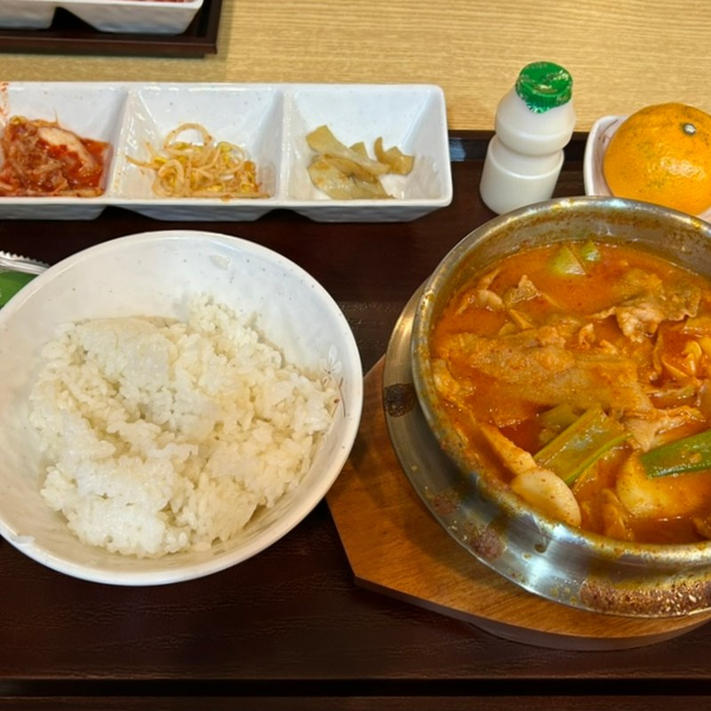

사진: 온뚝 · 카카오맵/블로그 리뷰 이미지

**취급 식당** 41곳 · **메뉴 항목** 106건 · **가격대** 2,700원 ~ 22,000원 (중앙값 7,500원)

| 식당 | 업종 | 대표 메뉴 · 가격 | 평점(리뷰수) | 캠퍼스 거리 |
|---|---|---|---|---:|
| **영종식당** | 한식 | 고등어조림 5,500원, 고등어자반 5,500원, 김치찌개 5,500원 | 카카오 4.8(4) / 다코 4(2) | 146m |
| **온뚝** | 한식 | 된장찌개 7,000원, 돼지김치찌개 7,500원, 부대찌개 7,500원 | 카카오 4.4(11) / 다코 4.4(4) | 164m |
| **참새식당** | 한식 | 백반 8,000원, 생고기김치찌개 9,000원, 부대찌개 9,000원 | 평점 없음 | 635m |
| **찌개사랑** | 찌개,전골 | 생고기김치찌개 7,000원, 된장찌개 7,000원, 제육볶음 7,500원 | 카카오 3.7(9) / 다코 4(1) | 241m |
| **다우리식당** | 한식 | 된장찌개 7,000원, 김치찌개 7,000원 | 카카오 4.4(16) | 178m |
| **소소한밥상** | 한식 | 백반 7,000원 | 카카오 5.0(3) | 450m |
| **맛사랑** | 한식 | 제육볶음 7,500원, 김치제육볶음 7,500원, 부대찌개 7,500원 | 카카오 3.6(28) / 다코 4.3(3) | 137m |
| **두아들뚝배기** | 한식 | 직화 뚝배기제육 9,500원 | 카카오 5.0(1) | 805m |

그 외 33곳: 바리바리, 이태리부대찌개, 인하 정일품, 청년밥상빨라우, 효자동솥뚜껑, 도원집, 역전냉삼겹, 당가네대박삼겹, 명가찜닭, 정식이네요리주점, 김밥브라더스, 한솥도시락인하대후문점…

## 우동·소바·소면

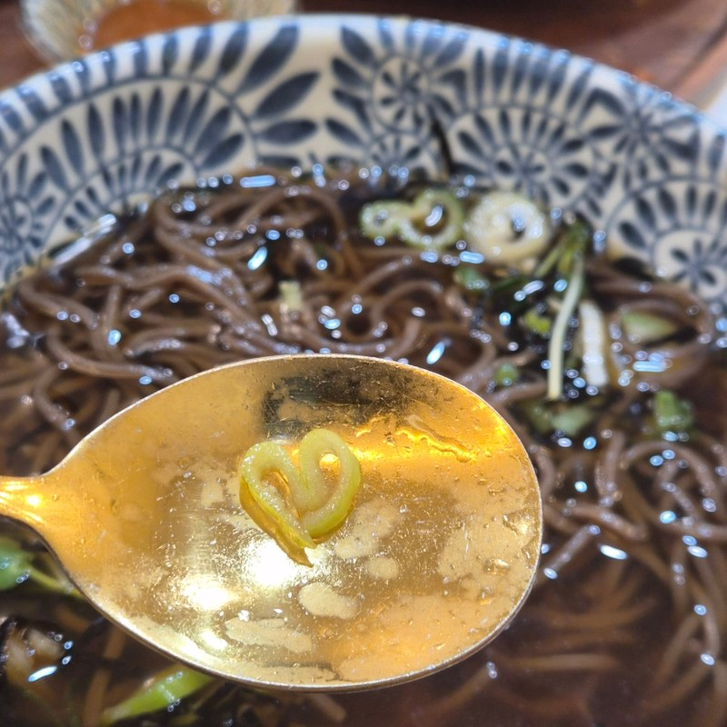

사진: 백소정 · 카카오맵/블로그 리뷰 이미지

**취급 식당** 34곳 · **메뉴 항목** 71건 · **가격대** 2,000원 ~ 19,900원 (중앙값 8,500원)

| 식당 | 업종 | 대표 메뉴 · 가격 | 평점(리뷰수) | 캠퍼스 거리 |
|---|---|---|---|---:|
| **시루 돈부리** | 일식 | 오뎅 우동 7,000원, 김치 우동 7,500원, 새우튀김 우동 8,500원 | 카카오 4.8(16) / 다코 3.9(6) | 756m |
| **백소정** | 돈까스,우동 | 냉소바 9,500원, 마제소바 9,900원, 카라이(辛)마제소바 10,500원 | 다코 4.1(9) | 87m |
| **백상현 돈까스** | 돈까스,우동 | 새우튀김우동 8,000원 | 카카오 5.0(12) / 다코 5(2) | 691m |
| **한창희천하일면** | 국수 | 아부라소바 —, 매운아부라소바 —, 소바 — | 카카오 2.1(9) / 다코 4.5(1) | 151m |
| **지금돈까스** | 돈까스,우동 | 어묵우동 8,000원 | 카카오 5.0(7) / 다코 4(2) | 857m |
| **오월의유부** | 일식 | 어우동 6,500원, 우육우동 8,000원 | 카카오 4.3(25) / 다코 3.5(4) | 708m |
| **탄포포** | 돈까스,우동 | 가쓰오우동 4,500원 | 카카오 4.0(22) / 다코 4.2(5) | 179m |
| **넋넋** | 호프,요리주점 | 넋넋한 맑은어묵탕 + 우동사리 17,900원, 넋넋한 김치어묵탕 + 우동사리 18,900원, 넋넋한 꼬막무침 + 소면사리 19,900원 | 카카오 4.3(18) / 다코 4.9(4) | 819m |

그 외 26곳: 동아리닭갈비, 긴자료코, 면식당, 감탄떡볶이, 하하돈면, 압구정수산시장, 소풍, 두손모밀, 김밥브라더스, 국제식당, 치즈를사랑한찜닭, 차오팡…

## 떡볶이·분식

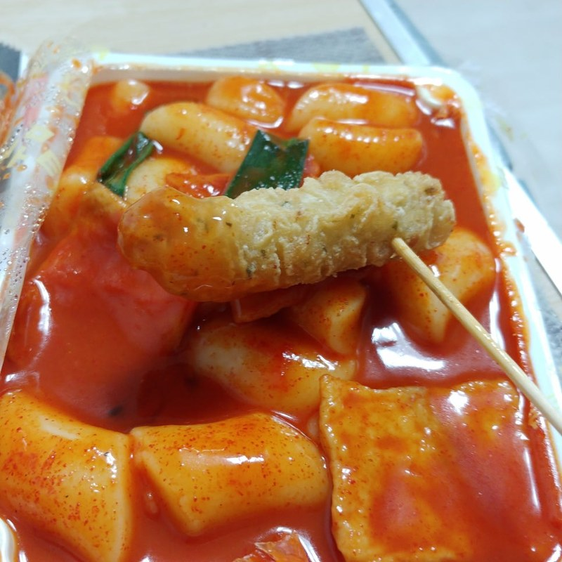

사진: 감탄떡볶이 · 카카오맵/블로그 리뷰 이미지

**취급 식당** 33곳 · **메뉴 항목** 128건 · **가격대** 1,000원 ~ 25,900원 (중앙값 5,900원)

| 식당 | 업종 | 대표 메뉴 · 가격 | 평점(리뷰수) | 캠퍼스 거리 |
|---|---|---|---|---:|
| **김밥브라더스** | 분식 | 꼬마김밥 2,000원, 브라더김밥 2,500원, 김치김밥 3,500원 | 카카오 4.7(39) / 다코 4.5(5) | 694m |
| **감탄떡볶이** | 감탄떡볶이 | 부산어묵 1,000원, 모둠어묵 1,500원, 우유튀김(5개) 2,000원 | 카카오 5.0(4) / 다코 5(1) | 111m |
| **삼청당** | 분식 | 삼청당김밥 4,500원, 묵은지김밥 5,300원, 아보명란마요김밥 6,200원 | 다코 3(1) | 174m |
| **소풍** | 분식 | 소풍김밥 3,000원, 김치김밥 3,500원, 치즈김밥 3,500원 | 카카오 3.0(5) / 다코 2(2) | 676m |
| **짝노패밀리** | 음식점 | 쥐포튀김 5,000원, 감자튀김 7,900원, 게맛살튀김 8,900원 | 카카오 4.7(3) / 다코 3.8(2) | 127m |
| **넋넋** | 호프,요리주점 | 수육튀김 추가 12,000원, 통통고추튀김 13,900원, 수육튀김 25,900원 | 카카오 4.3(18) / 다코 4.9(4) | 819m |
| **닭큐멘터리** | 치킨 | 감자튀김 —, 국물떡볶이 —, 떡볶이 — | 카카오 4.0(7) / 다코 4.5(2) | 252m |
| **국밥참맛있는집** | 국밥참맛있는집 | 볶음순대 —, 순대 한 상(국밥류+육순대) —, 삼색모둠순대 — | 카카오 4.2(12) / 다코 5(1) | 905m |

그 외 25곳: 담벼락, 아미고, 주접집, 맥주집, 래빗포차, 바베큐하우스, 아웃닭, 로바다야끼 시루, 어마어마해, 가마솥순대국인하대점, 핸즈업, 돗가비불쭈꾸미…

## 덮밥·회덮밥

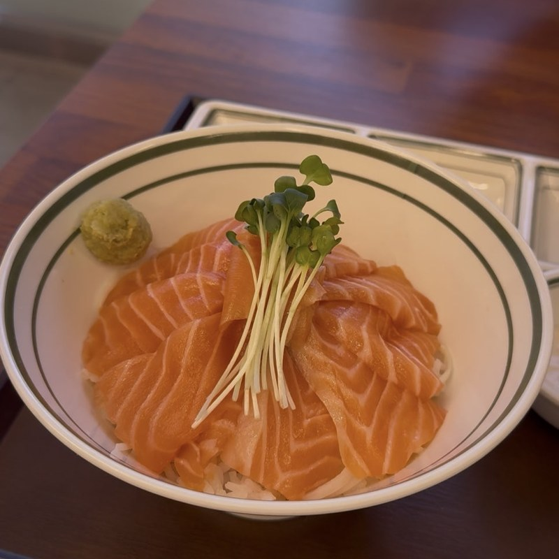

사진: 덮수룩 · 카카오맵/블로그 리뷰 이미지

**취급 식당** 31곳 · **메뉴 항목** 139건 · **가격대** 2,700원 ~ 16,500원 (중앙값 8,900원)

| 식당 | 업종 | 대표 메뉴 · 가격 | 평점(리뷰수) | 캠퍼스 거리 |
|---|---|---|---|---:|
| **밥은화** | 분식 | 참치마요덮밥 4,500원, 스팸마요덮밥 4,500원, 치킨마요덮밥 5,500원 | 카카오 4.8(10) | 154m |
| **밥은** | 분식 | 참치마요덮밥 4,500원, 스팸마요덮밥 4,500원, 치킨마요덮밥 5,500원 | 카카오 4.8(10) | 151m |
| **덮수룩** | 한식 | 스테이크덮밥 —, 연어덮밥 —, 항정살덮밥 — | 카카오 5.0(3) / 다코 4.5(1) | 417m |
| **시루 돈부리** | 일식 | 가츠동 8,500원, 김치가츠동 9,000원, 규동 9,500원 | 카카오 4.8(16) / 다코 3.9(6) | 756m |
| **지붕덮밥** | 도시락 | [불맛가득] 매콤 제육덮밥 10,900원, [감칠맛가득] 간장제육덮밥 10,900원, [쫄깃단짠] 치킨데리야끼 덮밥 10,900원 | 카카오 3.4(9) / 다코 5(2) | 442m |
| **포케품은초밥** | 일식 | 칠리갈릭새우포케 13,900원 | 카카오 5.0(2) / 다코 4.6(3) | 155m |
| **레이지다이노 포케&샐러드** | 샐러드 | 훈제오리 포케 8,900원, 두부버섯 포케 8,900원, 수비드 닭안심 포케 8,900원 | 카카오 5.0(12) / 다코 5(2) | 776m |
| **교반** | 한식 | 육회비빔밥 9,500원, 꼬막비빔밥 9,500원, 소고기비빔밥 9,500원 | 카카오 5.0(3) | 144m |

그 외 23곳: 지지고, 오월의유부, 한솥도시락인하대후문점, 가메이, 어마어마해, 인하 정일품, 본죽&비빔밥cafe, 김밥브라더스, 지금돈까스, 돗가비불쭈꾸미, 신촌샤브샤브, 긴자료코…

## 볶음밥·밥류

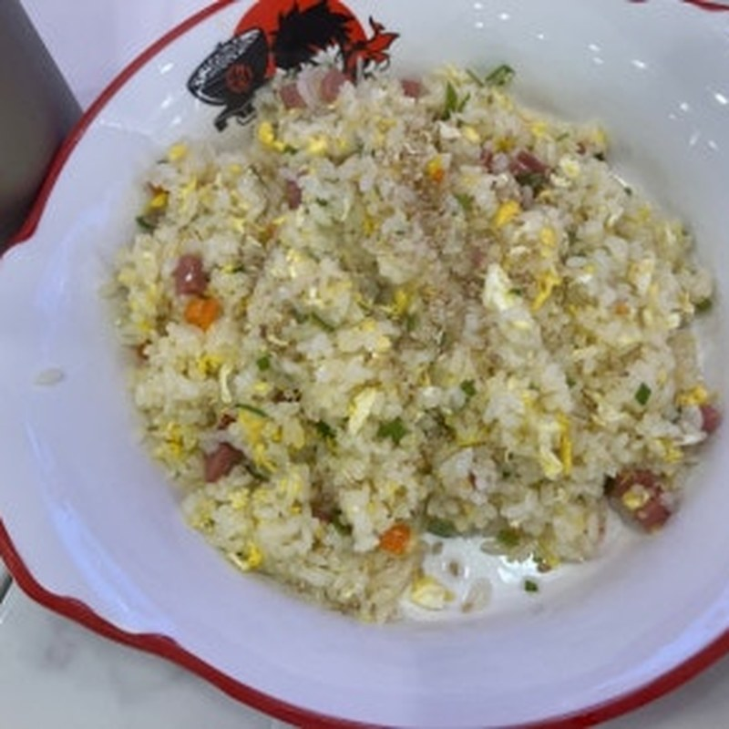

사진: 탕화쿵푸 · 카카오맵/블로그 리뷰 이미지

**취급 식당** 25곳 · **메뉴 항목** 50건 · **가격대** 1,000원 ~ 41,000원 (중앙값 5,200원)

| 식당 | 업종 | 대표 메뉴 · 가격 | 평점(리뷰수) | 캠퍼스 거리 |
|---|---|---|---|---:|
| **춘리마라탕** | 중국요리 | 볶음밥 7,000원 | 카카오 3.8(8) / 다코 5(2) | 246m |
| **차오팡** | 중국요리 | 새우볶음밥 10,000원, 해물누룽지탕 (소) 29,000원 | 카카오 4.5(56) / 다코 4.4(7) | 792m |
| **보화장** | 중국요리 | 볶음밥 8,000원, 삼선볶음밥 11,000원, 누룽지탕 41,000원 | 카카오 3.6(43) / 다코 2.7(5) | 622m |
| **중경마라탕** | 중국요리 | 볶음밥 8,000원 | 카카오 3.6(14) / 다코 3.8(4) | 163m |
| **김밥브라더스** | 분식 | 김치주먹밥 3,500원, 참치주먹밥 4,000원, 소고기주먹밥 4,300원 | 카카오 4.7(39) / 다코 4.5(5) | 694m |
| **한솥도시락인하대후문점** | 한솥도시락 | 한솥밥 1,200원, 김치볶음밥 4,400원, 스팸 김치볶음밥 5,200원 | 카카오 5.0(5) / 다코 3.5(1) | 120m |
| **소풍** | 분식 | 김치주먹밥 3,000원, 멸추주먹밥 3,000원, 참치주먹밥 3,500원 | 카카오 3.0(5) / 다코 2(2) | 676m |
| **코피아** | 양식 | 소세지와 베이컨 칠리 볶음밥 9,900원, 새우 칠리 볶음밥 11,000원 | 카카오 4.8(20) / 다코 4.4(5) | 185m |

그 외 17곳: 뼈앓이감자탕, 압구정수산시장, 팔각도, 동아리닭갈비, 빙그레정육식당, 꼬꼬얼큰이닭발, 오븐마루치킨, 주접집, 맥주집, 감탄떡볶이, 홍마담불뼈찜, 남도뽀글이…

## 삼겹살·고기구이

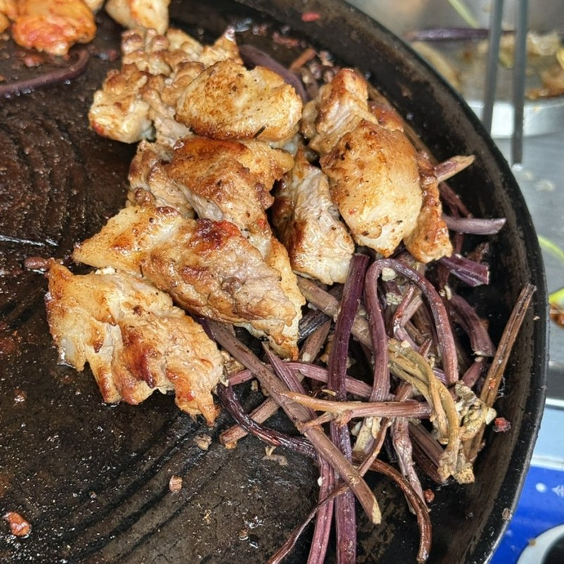

사진: 솥고기67번길 · 카카오맵/블로그 리뷰 이미지

**취급 식당** 25곳 · **메뉴 항목** 47건 · **가격대** 4,700원 ~ 47,900원 (중앙값 14,000원)

| 식당 | 업종 | 대표 메뉴 · 가격 | 평점(리뷰수) | 캠퍼스 거리 |
|---|---|---|---|---:|
| **효자동솥뚜껑** | 효자동솥뚜껑 | 듀록 흑돼지삼겹살+꽃목살(3인) 35,900원, 듀록 흑돼지삼겹살(3인) 35,900원, 꽃목살(3인) 35,900원 | 카카오 5.0(4) / 다코 5(1) | 194m |
| **경동삼겹살** | 삼겹살 | 목살양념구이쌈밥 9,000원, 옛날 삼겹살(180g) 9,500원, 생 삼겹살(180g) 10,000원 | 카카오 4.4(21) / 다코 4.8(4) | 126m |
| **당가네대박삼겹** | 삼겹살 | 삼겹살(150g) 8,000원 | 카카오 5.0(1) / 다코 3.5(2) | 229m |
| **솥고기67번길** | 삼겹살 | 삼겹살 9,900원 | 카카오 3.5(2) / 다코 3.6(3) | 212m |
| **숯불구이먹방** | 육류,고기 | 생삼겹살(150g) 7,500원, 생목살(150g) 7,500원, 허브삼겹살(150g) 7,900원 | 카카오 3.9(11) / 다코 3.3(2) | 149m |
| **행복한연탄구이** | 육류,고기 | 갈매기살 (200g) 15,000원, 삼겹살 (400g) 15,000원 | 카카오 4.4(11) / 다코 4(1) | 491m |
| **나사장네정육식당** | 육류,고기 | 삼겹살 (200g) 12,000원, 항정살 (200g) 12,000원 | 카카오 3.3(12) / 다코 4.5(2) | 616m |
| **대패공장** | 육류,고기 | 대패삼겹(100g) (3인이상) 4,700원 | 카카오 5.0(1) / 다코 5(1) | 87m |

그 외 17곳: 고기에진심인 남자, 역전냉삼겹, 이선생, 나쁜돼지, 하남돼지집, 닭살부부, 바베큐하우스, 운반미, 영지숯불갈비, 불판위에서춤추는갈매기, 닭큐멘터리, 팔각도…

## 만두·완당

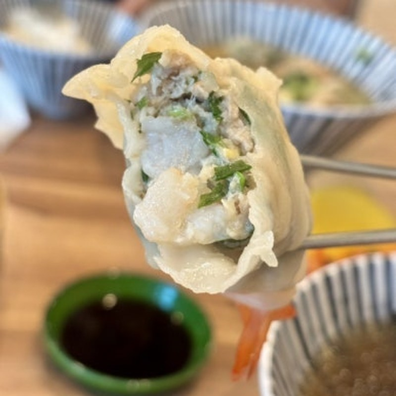

사진: 두손모밀 · 카카오맵/블로그 리뷰 이미지

**취급 식당** 25곳 · **메뉴 항목** 50건 · **가격대** 2,000원 ~ 18,000원 (중앙값 6,000원)

| 식당 | 업종 | 대표 메뉴 · 가격 | 평점(리뷰수) | 캠퍼스 거리 |
|---|---|---|---|---:|
| **두손모밀** | 한식 | 두손만두 4,000원, 김치만두 5,000원, 새우만두 6,000원 | 카카오 4.2(17) / 다코 4.2(7) | 864m |
| **내동칼국수** | 칼국수 | 내동칼만두 5,500원, 얼큰칼만두 5,500원, 만두국 5,500원 | 카카오 4.5(11) / 다코 4.2(3) | 172m |
| **인하칼국수** | 칼국수 | 찐만두 (고기) 7,500원, 찐만두 (김치) 7,500원, 칼만두 8,500원 | 카카오 4.2(34) / 다코 4.3(8) | 168m |
| **김밥브라더스** | 분식 | 고기만두 4,500원, 김치만두 4,500원, 만두국 6,000원 | 카카오 4.7(39) / 다코 4.5(5) | 694m |
| **신촌설렁탕** | 설렁탕 | 만두국 9,000원, 떡만두국 9,000원, 찐만두 9,000원 | 카카오 4.3(38) / 다코 4.1(5) | 133m |
| **밥은화** | 분식 | 한입야끼만두 2,000원, 닭껍질교자 2,500원 | 카카오 4.8(10) | 154m |
| **밥은** | 분식 | 한입야끼만두 2,000원, 닭껍질교자 2,500원 | 카카오 4.8(10) | 151m |
| **뼈앓이감자탕** | 감자탕 | 만두 — | 카카오 5.0(3) | 368m |

그 외 17곳: 돗가비불쭈꾸미, 치즈를사랑한찜닭, 국밥참맛있는집, 동네술집, 명가찜닭, 두아들뚝배기, 감탄떡볶이, 한솥도시락인하대후문점, 중경마라탕, 주접집, 맥주집, 짝노패밀리…

## 돈까스

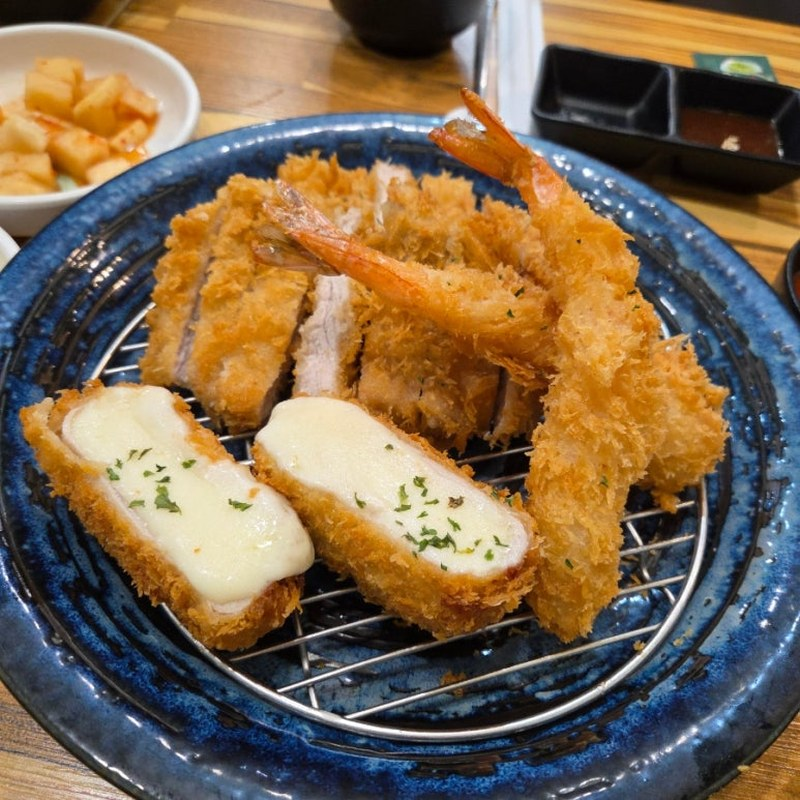

사진: 하하돈면 · 카카오맵/블로그 리뷰 이미지

**취급 식당** 21곳 · **메뉴 항목** 66건 · **가격대** 2,000원 ~ 18,900원 (중앙값 10,250원)

| 식당 | 업종 | 대표 메뉴 · 가격 | 평점(리뷰수) | 캠퍼스 거리 |
|---|---|---|---|---:|
| **백상현 돈까스** | 돈까스,우동 | 치킨 까스 9,000원, 왕 돈까스 10,000원, 치즈 돈까스 11,000원 | 카카오 5.0(12) / 다코 5(2) | 691m |
| **지금돈까스** | 돈까스,우동 | 등심돈까스 9,000원, 카레돈까스 10,000원, 치즈돈까스 11,000원 | 카카오 5.0(7) / 다코 4(2) | 857m |
| **백소정** | 돈까스,우동 | 돈카츠(로스카츠) 10,500원, 모짜렐라치즈카츠(4pcs) 12,900원, 오꼬노미카츠 12,900원 | 다코 4.1(9) | 87m |
| **돈마니** | 돈까스,우동 | 돈가스부페 7,500원 | 카카오 4.5(66) / 다코 3.6(2) | 172m |
| **맹호수제돈까스** | 맹호수제돈까스 | 맹호수제등심돈까스 —, 맹호수제치즈돈까스 —, 고구마치즈돈까스 — | 카카오 3.5(2) | 646m |
| **구름카츠** | 돈까스,우동 | 카츠마제세트(안심) 18,900원, 카츠마제세트(치즈) 18,900원, 카츠냉모밀세트(안심) 18,900원 | 카카오 3.3(7) / 다코 4.8(2) | 142m |
| **하하돈면** | 한식 | 수제돈가스 8,900원, 매운돈가스 9,900원, 카레돈가스 9,900원 | 카카오 4.9(8) / 다코 4(1) | 112m |
| **면식당** | 면식당 | 반반카츠 11,900원, 모짜치즈카츠 12,500원, 매콤카레카츠 13,500원 | 카카오 3.1(9) / 다코 4.6(3) | 99m |

그 외 13곳: 성수완당, 탄포포, 한솥도시락인하대후문점, 긴자료코, 돗가비불쭈꾸미, 소풍, 시루 돈부리, 밥은화, 밥은, 김밥브라더스, 고마워감자탕, 찌개사랑…

## 치킨·통닭

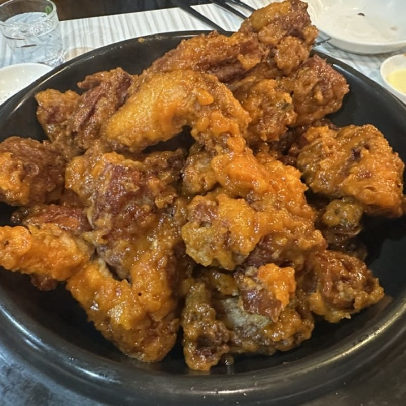

사진: 닭큐멘터리 · 카카오맵/블로그 리뷰 이미지

**취급 식당** 19곳 · **메뉴 항목** 60건 · **가격대** 3,200원 ~ 22,800원 (중앙값 11,900원)

| 식당 | 업종 | 대표 메뉴 · 가격 | 평점(리뷰수) | 캠퍼스 거리 |
|---|---|---|---|---:|
| **아웃닭** | 치킨 | 프린스턴 후라이드 치킨 20,900원, 스펜서 매운양념 치킨 21,900원, 린드필드 순살 치킨 22,800원 | 카카오 4.3(13) / 다코 3.5(5) | 160m |
| **썬더치킨** | 썬더치킨 | 옥계리감자치킨 —, 맵꼬만치킨 —, 골든커리치킨 — | 카카오 4.1(17) / 다코 4.7(3) | 213m |
| **닭살부부** | 치킨 | 전기구이 통닭 14,000원 | 카카오 5.0(42) / 다코 4.4(14) | 285m |
| **닭큐멘터리** | 치킨 | 후라이드 —, 마늘치킨 —, 간장치킨 — | 카카오 4.0(7) / 다코 4.5(2) | 252m |
| **커리야** | 인도음식 | 탄두리 치킨 (HALF) 11,000원, 치킨 마크니 11,000원, 치킨 티카 11,000원 | 카카오 4.3(32) / 다코 4(11) | 204m |
| **오븐마루치킨** | 오븐마루치킨 | 까르보 현미베이크 (순살전용) — | 카카오 5.0(3) / 다코 5(1) | 486m |
| **아미고** | 호프,요리주점 | 바베큐 비어치킨 (한마리) 14,000원, 후라이드 (M) 14,000원 | 카카오 3.7(7) / 다코 3.4(3) | 210m |
| **한솥도시락인하대후문점** | 한솥도시락 | 한솥닭강정(소) 3,500원, 크림닭강정(소) 3,900원, 후라이드 순살(소) 양념치킨소스 4,000원 | 카카오 5.0(5) / 다코 3.5(1) | 120m |

그 외 11곳: 1943, 담벼락, 코피아, 차오팡, 동네술집, 국제식당, 순목, 감탄떡볶이, 정식이네요리주점, 오드룸, 화양연화

## 샤브샤브·전골

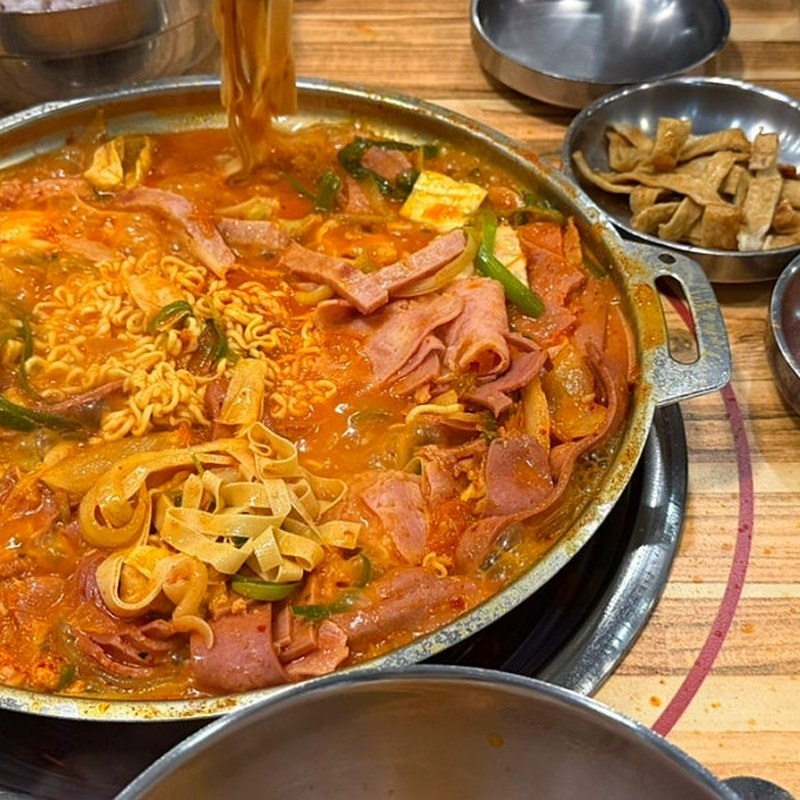

사진: 이태리부대찌개 · 카카오맵/블로그 리뷰 이미지

**취급 식당** 18곳 · **메뉴 항목** 31건 · **가격대** 11,000원 ~ 41,000원 (중앙값 23,500원)

| 식당 | 업종 | 대표 메뉴 · 가격 | 평점(리뷰수) | 캠퍼스 거리 |
|---|---|---|---|---:|
| **이태리부대찌개** | 찌개,전골 | 부대전골 11,000원, 우삼겹부대전골 (중) 39,000원, 등심부대전골 (중) 41,000원 | 카카오 4.6(21) / 다코 3.5(2) | 550m |
| **신촌설렁탕** | 설렁탕 | 육개장전골(소) 24,000원, 수육전골(소) 24,000원, 육개장전골(중) 29,000원 | 카카오 4.3(38) / 다코 4.1(5) | 133m |
| **대패공장** | 육류,고기 | 우삼겹전골(1인) (2인이상) 11,000원, 우렁들깨전골(1인) (2인이상) 11,000원 | 카카오 5.0(1) / 다코 5(1) | 87m |
| **도원집** | 한식 | 도원곱대창전골 35,000원 | 카카오 4.8(10) | 548m |
| **명가찜닭** | 닭요리 | 낙지전골 小 15,000원, 낙지전골 中 20,000원 | 카카오 5.0(1) | 380m |
| **참새식당** | 한식 | 부대전골 19,000원, 김치전골 19,000원 | 평점 없음 | 635m |
| **순목** | 호프,요리주점 | 밀푀유나베 17,000원, 소고기 부추말이 전골 20,000원 | 카카오 5.0(2) / 다코 5(1) | 166m |
| **동네술집** | 호프,요리주점 | 밀푀유나베 25,000원 | 카카오 4.5(6) / 다코 4(1) | 574m |

그 외 10곳: 두손모밀, 팔각도, 국밥참맛있는집, 국민정서, 화양연화, 니센, 조선탕반, 아미고, 동춘돌곱창, 더진국 수육국밥

## 라멘

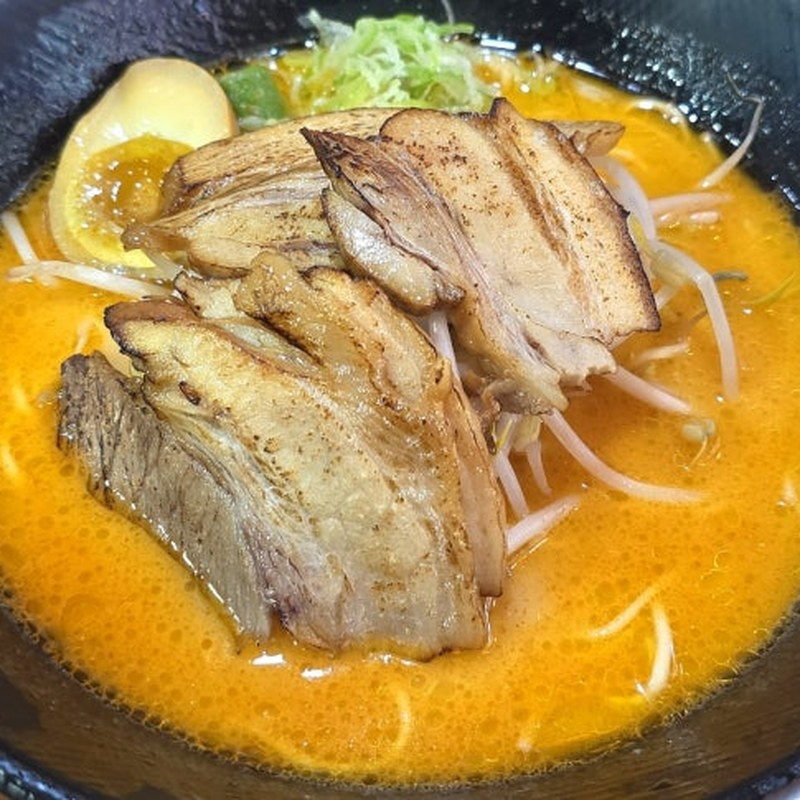

사진: 산쪼메 · 카카오맵/블로그 리뷰 이미지

**취급 식당** 16곳 · **메뉴 항목** 34건 · **가격대** 3,500원 ~ 11,000원 (중앙값 5,000원)

| 식당 | 업종 | 대표 메뉴 · 가격 | 평점(리뷰수) | 캠퍼스 거리 |
|---|---|---|---|---:|
| **멘지** | 일본식라면 | 카라탄탄멘 11,000원 | 다코 4.7(2) | 149m |
| **산쪼메** | 일본식라면 | 시오버터라멘 8,000원, 쇼유라멘 8,000원, 돈코츠라멘 8,500원 | 카카오 3.5(33) / 다코 4.3(14) | 267m |
| **어마어마해** | 일식 | 라면 —, 해물라면 — | 카카오 4.0(4) / 다코 4.2(2) | 868m |
| **김밥브라더스** | 분식 | 라면 3,500원, 치즈라면 4,000원, 떡라면 4,000원 | 카카오 4.7(39) / 다코 4.5(5) | 694m |
| **면식당** | 면식당 | 돈코츠라멘 7,900원, 소유라멘 7,900원, 매운돈코츠라멘 8,400원 | 카카오 3.1(9) / 다코 4.6(3) | 99m |
| **소풍** | 분식 | 신라면 4,000원, 떡라면 4,500원, 치즈라면 4,500원 | 카카오 3.0(5) / 다코 2(2) | 676m |
| **밥은화** | 분식 | 라면 4,000원 | 카카오 4.8(10) | 154m |
| **밥은** | 분식 | 라면 4,000원 | 카카오 4.8(10) | 151m |

그 외 8곳: 바다향기, 신촌샤브샤브, 주접집, 맥주집, 래빗포차, 바베큐하우스, 나쁜돼지, 동춘돌곱창

## 소고기·한우

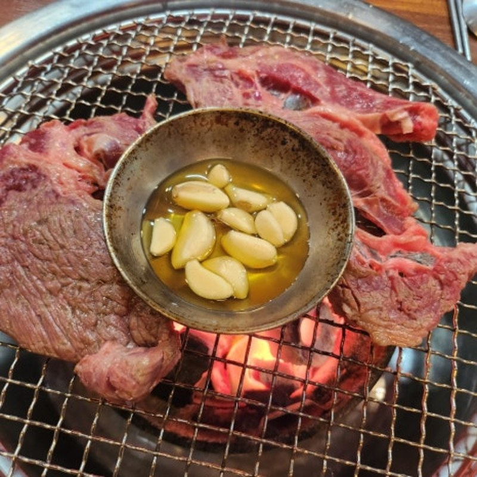

사진: 빙그레정육식당 · 카카오맵/블로그 리뷰 이미지

**취급 식당** 15곳 · **메뉴 항목** 25건 · **가격대** 3,500원 ~ 32,000원 (중앙값 15,000원)

| 식당 | 업종 | 대표 메뉴 · 가격 | 평점(리뷰수) | 캠퍼스 거리 |
|---|---|---|---|---:|
| **빙그레정육식당** | 육류,고기 | 등심(100g) 5,900원, 살치살(100g) 10,000원, 양념소갈비살 (180g) 16,500원 | 카카오 4.6(12) / 다코 4.6(3) | 172m |
| **우리소 참한우** | 육류,고기 | 차돌박이 (180g) 22,000원, 꽃등심 (180g) 25,000원 | 카카오 4.3(30) / 다코 3.4(3) | 396m |
| **나사장네정육식당** | 육류,고기 | 우삼겹 (200g) 16,000원, 소 갈비살 (200g) 18,000원 | 카카오 3.3(12) / 다코 4.5(2) | 616m |
| **대패공장** | 육류,고기 | 차돌박이(100g) (3인이상) 7,500원 | 카카오 5.0(1) / 다코 5(1) | 87m |
| **숯불구이먹방** | 육류,고기 | 우삼겹(150g) 8,000원, 차돌박이(150g) 12,900원 | 카카오 3.9(11) / 다코 3.3(2) | 149m |
| **이선생** | 중국요리 | 숙성양등심(100g) 15,000원 | 카카오 4.3(3) / 다코 5(2) | 776m |
| **팔각도** | 팔각도 | 닭 안창살 — | 카카오 4.0(10) / 다코 4.2(4) | 770m |
| **오월의유부** | 일식 | 단짠우삼겹 3,500원, 한우육회 3,600원, 매콤우삼겹 3,600원 | 카카오 4.3(25) / 다코 3.5(4) | 708m |

그 외 7곳: 구름카츠, 미연팔복반점, 국제식당, 동춘돌곱창, 국민정서, 화양연화, 으뜸스시

## 초밥·회

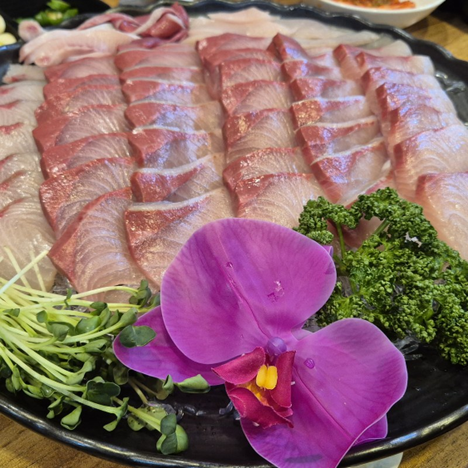

사진: 바다향기 · 카카오맵/블로그 리뷰 이미지

**취급 식당** 15곳 · **메뉴 항목** 58건 · **가격대** 5,000원 ~ 55,000원 (중앙값 15,000원)

| 식당 | 업종 | 대표 메뉴 · 가격 | 평점(리뷰수) | 캠퍼스 거리 |
|---|---|---|---|---:|
| **바다향기** | 회 | 활어초밥(10p) 15,000원, 활어물회(1인) 18,000원, 연어초밥(10p) 18,000원 | 카카오 4.9(16) / 다코 3.9(4) | 855m |
| **날마다신선회** | 회 | 광어회 (소) 28,000원, 우럭회 (중) 30,000원, 연어회 30,000원 | 카카오 5.0(3) / 다코 4.2(3) | 879m |
| **장봉배터집** | 회 | 광어회 —, 우럭회 — | 카카오 4.7(56) / 다코 4.3(3) | 643m |
| **으뜸스시** | 으뜸스시 | 생가리비초밥(4p) 5,000원, 솔방울한치초밥(4p) 5,000원, 갑오징어초밥(4p) 5,000원 | 카카오 3.1(10) / 다코 4(1) | 762m |
| **어마어마해** | 일식 | 활어초밥 —, 광어초밥 —, 연어초밥 — | 카카오 4.0(4) / 다코 4.2(2) | 868m |
| **우리소 참한우** | 육류,고기 | 육회 (200g) 18,000원 | 카카오 4.3(30) / 다코 3.4(3) | 396m |
| **가메이** | 일식 | 숙성연어사시미(소) 24,000원, 숙성연어사시미(중) 34,000원 | 카카오 3.5(29) / 다코 4.1(8) | 127m |
| **국제식당** | 일본식주점 | 사시미 1人 (광어, 연어, 참치 中 1) 13,500원, 참치 육회 16,900원, 사시미 명란 무침 16,900원 | 카카오 4.3(18) / 다코 4.6(3) | 170m |

그 외 7곳: 영지숯불갈비, 김밥브라더스, 숯불구이먹방, 참새식당, 동춘돌곱창, 본죽&비빔밥cafe, 맛사랑

## 타코야키·일식안주

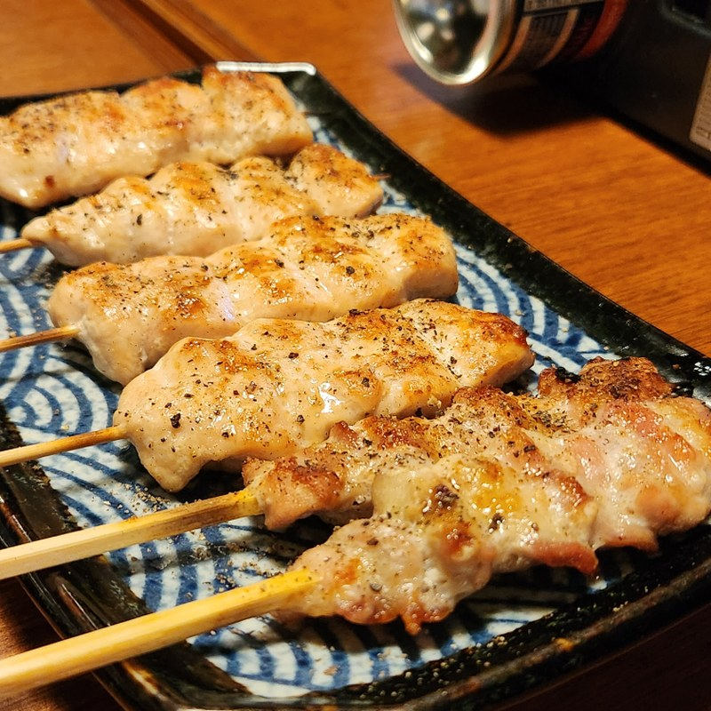

사진: 니센 · 카카오맵/블로그 리뷰 이미지

**취급 식당** 13곳 · **메뉴 항목** 16건 · **가격대** 8,900원 ~ 17,000원 (중앙값 12,900원)

| 식당 | 업종 | 대표 메뉴 · 가격 | 평점(리뷰수) | 캠퍼스 거리 |
|---|---|---|---|---:|
| **니센** | 일본식주점 | 오징어 가라아게 8,900원, 치킨난반 12,900원, 튤립 가라아게 12,900원 | 카카오 3.8(6) / 다코 5(2) | 175m |
| **시루 돈부리** | 일식 | 가라아게 카레 10,000원 | 카카오 4.8(16) / 다코 3.9(6) | 756m |
| **압구정수산시장** | 일본식주점 | 오뎅탕 13,000원 | 카카오 5.0(4) / 다코 5(2) | 132m |
| **로바다야끼 시루** | 일본식주점 | 치킨가라아게 15,000원 | 카카오 4.1(17) / 다코 4.4(4) | 878m |
| **꼬꼬얼큰이닭발** | 닭요리 | 오뎅탕 10,000원 | 카카오 4.7(7) / 다코 5(1) | 406m |
| **순목** | 호프,요리주점 | 오뎅탕 17,000원 | 카카오 5.0(2) / 다코 5(1) | 166m |
| **국민정서** | 호프,요리주점 | 소주안주 베스트 어묵탕 15,000원 | 다코 3.5(1) | 204m |
| **짝노패밀리** | 음식점 | 오뎅탕 10,900원 | 카카오 4.7(3) / 다코 3.8(2) | 127m |

그 외 5곳: 래빗포차, 바베큐하우스, 고기미담, 아미고, 담벼락

## 닭발·매운안주

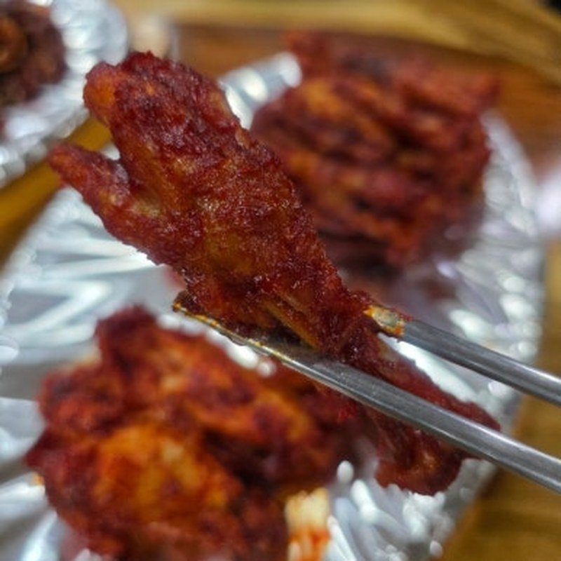

사진: 꼬꼬얼큰이닭발 · 카카오맵/블로그 리뷰 이미지

**취급 식당** 13곳 · **메뉴 항목** 26건 · **가격대** 5,000원 ~ 29,000원 (중앙값 16,000원)

| 식당 | 업종 | 대표 메뉴 · 가격 | 평점(리뷰수) | 캠퍼스 거리 |
|---|---|---|---|---:|
| **꼬꼬얼큰이닭발** | 닭요리 | 돼지껍데기 11,000원, 오돌뼈 14,000원, 매운똥집 14,000원 | 카카오 4.7(7) / 다코 5(1) | 406m |
| **동아리닭갈비** | 닭요리 | 무뼈닭발 16,000원, 치즈무뼈닭발 20,000원, 무뼈닭발셋트 22,000원 | 카카오 4.2(21) / 다코 4.5(6) | 185m |
| **국민정서** | 호프,요리주점 | 근이사랑 무뼈닭발 15,000원, 특제소스오돌뼈볶음 15,000원 | 다코 3.5(1) | 204m |
| **동네술집** | 호프,요리주점 | 국물닭발 19,000원 | 카카오 4.5(6) / 다코 4(1) | 574m |
| **아미고** | 호프,요리주점 | 무뼈닭발 17,000원 | 카카오 3.7(7) / 다코 3.4(3) | 210m |
| **담벼락** | 호프,요리주점 | 돼지껍데기볶음 14,000원 | 카카오 3.3(6) | 175m |
| **천지인** | 호프,요리주점 | 돼지껍데기(1인분) 5,000원 | 카카오 2.7(15) / 다코 4.8(2) | 185m |
| **도원집** | 한식 | 숯불직화튤립닭발 22,000원, 마그마국물닭발 25,000원 | 카카오 4.8(10) | 548m |

그 외 5곳: 행복한연탄구이, 영지숯불갈비, 오븐마루치킨, 래빗포차, 닭큐멘터리

## 파스타·리조또

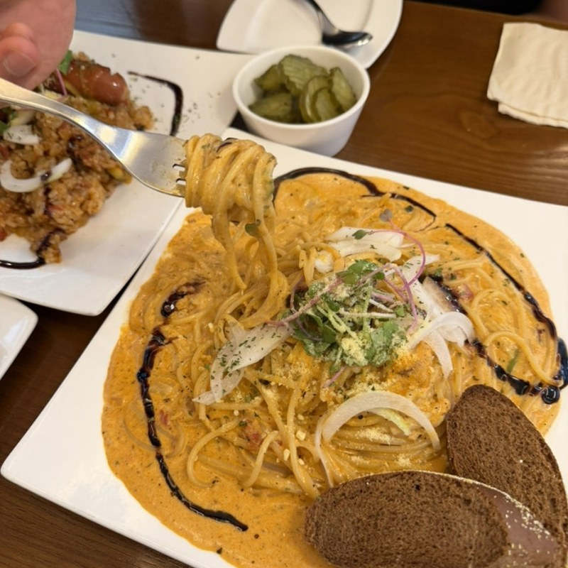

사진: 코피아 · 카카오맵/블로그 리뷰 이미지

**취급 식당** 11곳 · **메뉴 항목** 61건 · **가격대** 7,000원 ~ 22,000원 (중앙값 12,000원)

| 식당 | 업종 | 대표 메뉴 · 가격 | 평점(리뷰수) | 캠퍼스 거리 |
|---|---|---|---|---:|
| **코피아** | 양식 | 매콤한 마늘오일 파스타 8,900원, 베이컨 크림 파스타 9,500원, 모짜렐라 치즈크림 리조또 9,900원 | 카카오 4.8(20) / 다코 4.4(5) | 185m |
| **라르고** | 이탈리안 | 바질새우 오일파스타 17,500원, 블루치즈 뇨끼 18,000원, 우삼겹 로제리조또 18,000원 | 카카오 4.6(5) / 다코 4.7(7) | 857m |
| **까사 올리브** | 양식 | 까르보나라 (런치) 11,000원, 미트치즈오븐스파게티 (런치) 11,000원 | 카카오 3.9(11) / 다코 3.3(2) | 274m |
| **쇼앤플레이트** | 호프,요리주점 | 알리오올리오 8,900원, 쉬림프 매콤 토마토 파스타 9,900원, 크림파스타 9,900원 | 다코 5(1) | 128m |
| **커리야** | 인도음식 | 베지터블 커리 파스타 11,000원, 치킨 커리 파스타 11,500원, 씨푸드 커리 파스타 12,000원 | 카카오 4.3(32) / 다코 4(11) | 204m |
| **미식당** | 호프,요리주점 | 머쉬룸파스타 7,000원, 까르보나라 7,700원, 쉬림프베이컨로제파스타 7,900원 | 카카오 3.5(25) / 다코 4.2(4) | 129m |
| **서가앤쿡** | 서가앤쿡 | 베이컨 까르보나라 14,900원, 베이컨 로제 파스타 14,900원, 해산물 토마토 파스타 14,900원 | 카카오 3.3(12) / 다코 4.1(7) | 704m |
| **주접집** | 호프,요리주점 | 불닭까르보나라 —, 빠네크림파스타 —, 봉골레파스타 — | 카카오 4.6(5) / 다코 4.3(6) | 186m |

그 외 3곳: 맥주집, 치즈웨이브, 정식이네요리주점

## 커피·음료

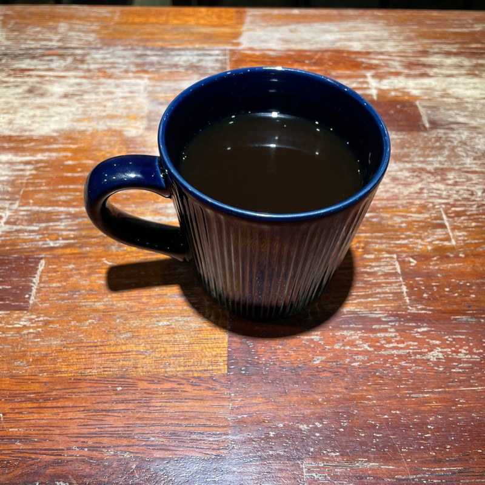

사진: 카페 더 스토리 · 카카오맵/블로그 리뷰 이미지

**취급 식당** 11곳 · **메뉴 항목** 69건 · **가격대** 3,000원 ~ 10,500원 (중앙값 5,000원)

| 식당 | 업종 | 대표 메뉴 · 가격 | 평점(리뷰수) | 캠퍼스 거리 |
|---|---|---|---|---:|
| **huki** | 카페 | 아메리카노 4,000원, 복숭아 아이스티 4,000원, 얼그레이 4,000원 | 카카오 4.9(9) / 다코 5(2) | 450m |
| **카페 오디디오** | 카페 | 아메리카노(오리지널) 3,000원, 아메리카노(디카페인) 4,000원, 카페라떼 4,000원 | 카카오 5.0(7) / 다코 4.4(6) | 925m |
| **닉스냅** | 카페 | 에스프레소 4,500원, 아메리카노 4,800원, 카페라떼 5,000원 | 카카오 4.5(12) / 다코 4.6(3) | 242m |
| **더비하우스** | 디저트카페 | 아메리카노 4,000원, 라떼 4,500원, 바닐라라떼 5,000원 | 카카오 4.3(4) / 다코 4.6(2) | 857m |
| **카페 더 스토리** | 카페 | 초코라떼 —, 오곡라떼 —, 고구마라떼 — | 카카오 3.9(9) / 다코 3(2) | 184m |
| **더즈오프커피** | 카페 | 아메리카노 3,500원, 밀크티 4,800원 | 카카오 4.6(14) / 다코 4(2) | 550m |
| **스톡홀름 샐러드** | 샐러드 | 아메리카노 3,000원, 라떼 3,500원 | 카카오 5.0(10) / 다코 5(3) | 324m |
| **913** | 카페 | 아메리카노 4,500원, 에스프레소 4,500원, 카페라떼 4,800원 | 카카오 2.2(60) / 다코 4(6) | 512m |

그 외 3곳: 주접집, 맥주집, 오드룸

## 순두부

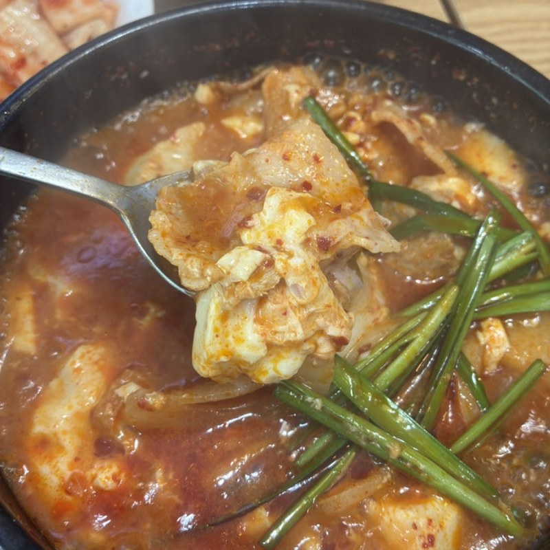

사진: 킹콩순두부 · 카카오맵/블로그 리뷰 이미지

**취급 식당** 11곳 · **메뉴 항목** 22건 · **가격대** 6,000원 ~ 15,000원 (중앙값 8,200원)

| 식당 | 업종 | 대표 메뉴 · 가격 | 평점(리뷰수) | 캠퍼스 거리 |
|---|---|---|---|---:|
| **킹콩순두부** | 두부전문점 | 해물순두부 8,500원, 햄치즈순두부 8,500원, 만두순두부 8,500원 | 카카오 3.2(14) / 다코 5(1) | 158m |
| **온뚝** | 한식 | 순두부찌개 7,000원, 햄치즈순두부찌개 7,500원, 고기순두부찌개 7,500원 | 카카오 4.4(11) / 다코 4.4(4) | 164m |
| **김밥브라더스** | 분식 | 순두부찌개 6,000원, 해물순두부 7,000원 | 카카오 4.7(39) / 다코 4.5(5) | 694m |
| **찌개사랑** | 찌개,전골 | 순두부찌개 7,000원 | 카카오 3.7(9) / 다코 4(1) | 241m |
| **팔각도** | 팔각도 | 해물 순두부찌개 — | 카카오 4.0(10) / 다코 4.2(4) | 770m |
| **참새식당** | 한식 | 순두부찌개 9,000원 | 평점 없음 | 635m |
| **짝노패밀리** | 음식점 | 해물+햄순두부 7,900원 | 카카오 4.7(3) / 다코 3.8(2) | 127m |
| **래빗포차** | 음식점 | 얼큰순두부 — | 카카오 5.0(1) | 917m |

그 외 3곳: 맛사랑, 담벼락, 소풍

## 국밥·순대국

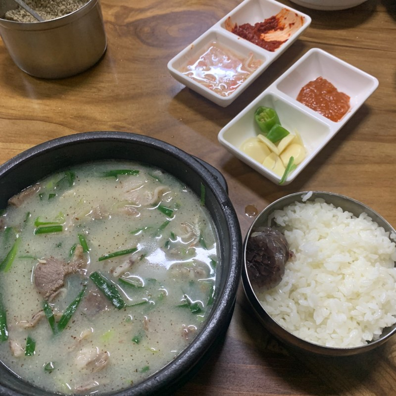

사진: 가마솥순대국인하대점 · 카카오맵/블로그 리뷰 이미지

**취급 식당** 10곳 · **메뉴 항목** 35건 · **가격대** 8,000원 ~ 12,000원 (중앙값 10,000원)

| 식당 | 업종 | 대표 메뉴 · 가격 | 평점(리뷰수) | 캠퍼스 거리 |
|---|---|---|---|---:|
| **가마솥순대국인하대점** | 순대 | 순대국 10,000원, 고기만순대국 10,000원, 순대만순대국 10,000원 | 카카오 4.3(22) | 519m |
| **국밥참맛있는집** | 국밥참맛있는집 | 병천육순대국밥 —, 돼지국밥 —, 순살국밥 (살코기) — | 카카오 4.2(12) / 다코 5(1) | 905m |
| **승일순대국밥** | 순대 | 순대국밥 — | 평점 없음 | 472m |
| **조선탕반** | 국밥 | 수육국밥 8,500원, 얼큰수육국밥 9,500원, 수육국밥정식 11,000원 | 카카오 3.7(18) / 다코 5(1) | 111m |
| **성화해장국** | 해장국 | 소내장탕 10,000원 | 카카오 4.5(25) / 다코 4(1) | 415m |
| **박지혜 모던순대국 소머리국밥** | 순대 | 순대국 8,000원, 얼큰순대국 9,000원, 옛날순대국 (특) 9,000원 | 카카오 2.6(15) / 다코 4(1) | 152m |
| **홍마담불뼈찜** | 감자탕 | 순대국 8,000원, 소내장탕 10,000원 | 카카오 4.2(13) / 다코 4(1) | 511m |
| **두아들뚝배기** | 한식 | 콩나물국밥 8,900원 | 카카오 5.0(1) | 805m |

그 외 2곳: 더진국 수육국밥, 숯불구이먹방

## 감자탕·뼈해장국

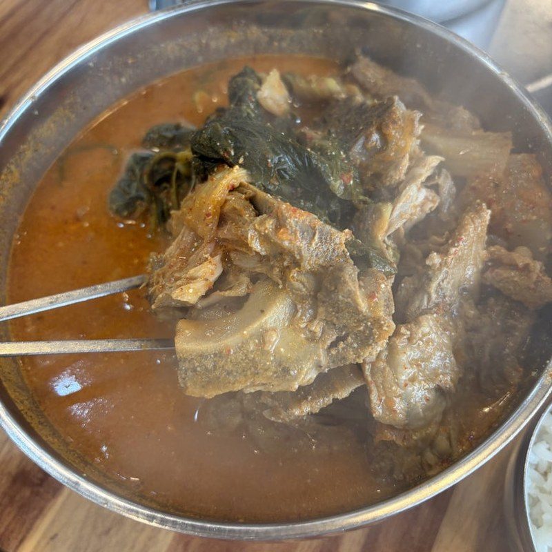

사진: 뼈앓이감자탕 · 카카오맵/블로그 리뷰 이미지

**취급 식당** 10곳 · **메뉴 항목** 35건 · **가격대** 7,000원 ~ 42,000원 (중앙값 29,500원)

| 식당 | 업종 | 대표 메뉴 · 가격 | 평점(리뷰수) | 캠퍼스 거리 |
|---|---|---|---|---:|
| **뼈앓이감자탕** | 감자탕 | 뼈해장국 —, 감자탕 —, 등뼈찜 — | 카카오 5.0(3) | 368m |
| **홍마담불뼈찜** | 감자탕 | 불뼈찜(1인분) 8,000원, 간장뼈찜(1인분) 8,000원, 뼈해장국(1인분) 8,000원 | 카카오 4.2(13) / 다코 4(1) | 511m |
| **고마워감자탕** | 감자탕 | 뼈해장국 10,000원, 순살뼈해장국 11,000원, 우거지감자탕 (소) 32,000원 | 다코 3.8(3) | 436m |
| **명화옥감자탕** | 감자탕 | 뼈해장국 9,000원, 감자탕(소) 29,000원 | 카카오 4.7(7) / 다코 4.6(4) | 696m |
| **청진동해장국** | 청진동해장국 | 감자탕(소) 25,000원, 감자탕(중) 30,000원, 감자탕(대) 35,000원 | 카카오 3.6(20) / 다코 4.5(1) | 192m |
| **숯불구이먹방** | 육류,고기 | 감자탕(소) 27,000원, 감자탕(중) 32,000원, 감자탕(대) 37,000원 | 카카오 3.9(11) / 다코 3.3(2) | 149m |
| **성화해장국** | 해장국 | 뼈해장국 9,000원 | 카카오 4.5(25) / 다코 4(1) | 415m |
| **시골집** | 닭요리 | 뼈해장국 7,000원 | 카카오 4.8(5) / 다코 4(1) | 158m |

그 외 2곳: 국밥참맛있는집, 더진국 수육국밥

## 칼국수·수제비

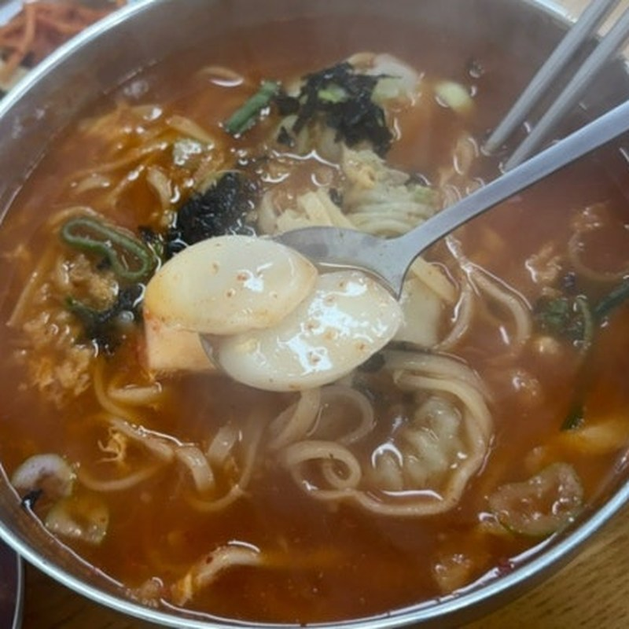

사진: 내동칼국수 · 카카오맵/블로그 리뷰 이미지

**취급 식당** 10곳 · **메뉴 항목** 28건 · **가격대** 5,000원 ~ 34,000원 (중앙값 8,000원)

| 식당 | 업종 | 대표 메뉴 · 가격 | 평점(리뷰수) | 캠퍼스 거리 |
|---|---|---|---|---:|
| **내동칼국수** | 칼국수 | 내동칼국수 5,000원, 얼큰칼국수 5,000원, 손수제비 6,000원 | 카카오 4.5(11) / 다코 4.2(3) | 172m |
| **인하칼국수** | 칼국수 | 바지락칼국수 8,500원, 들깨칼국수 9,500원, 매운칼국수 9,500원 | 카카오 4.2(34) / 다코 4.3(8) | 168m |
| **큰손샤브샤브** | 샤브샤브 | 얼큰 샤브 칼국수(소) 19,000원, 얼큰 샤브 칼국수(중) 27,000원, 얼큰 샤브 칼국수(대) 34,000원 | 카카오 4.0(10) / 다코 4.7(5) | 156m |
| **돗가비불쭈꾸미** | 해물,생선 | 감자수제비 8,000원, 들깨수제비 10,000원, 들깨메밀칼국수 10,000원 | 카카오 5.0(20) / 다코 4.6(2) | 795m |
| **김밥브라더스** | 분식 | 칼국수 5,500원, 수제비 5,500원, 김치칼국수 6,000원 | 카카오 4.7(39) / 다코 4.5(5) | 694m |
| **1943** | 술집 | 닭한마리칼국수 12,900원 | 카카오 3.6(5) | 852m |
| **팔각도** | 팔각도 | 비빔 칼국수 —, 짬뽕 칼국수 — | 카카오 4.0(10) / 다코 4.2(4) | 770m |
| **국밥참맛있는집** | 국밥참맛있는집 | 얼큰육개장칼국수 — | 카카오 4.2(12) / 다코 5(1) | 905m |

그 외 2곳: 담벼락, 소풍

## 짜장면·짬뽕

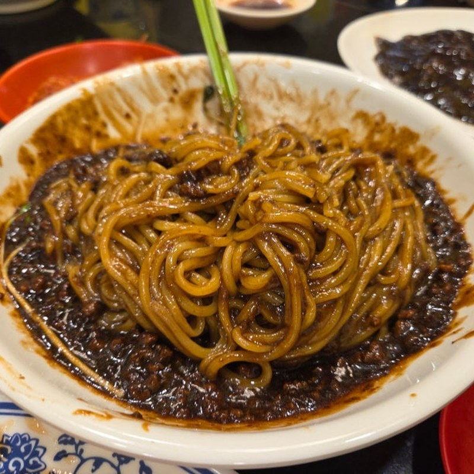

사진: 보화장 · 카카오맵/블로그 리뷰 이미지

**취급 식당** 10곳 · **메뉴 항목** 36건 · **가격대** 5,000원 ~ 22,000원 (중앙값 11,500원)

| 식당 | 업종 | 대표 메뉴 · 가격 | 평점(리뷰수) | 캠퍼스 거리 |
|---|---|---|---|---:|
| **차오팡** | 중국요리 | 짜장면 8,000원, 짬뽕 9,000원, 짬뽕밥 9,000원 | 카카오 4.5(56) / 다코 4.4(7) | 792m |
| **보화장** | 중국요리 | 짜장 6,000원, 유니짜장 8,000원, 간짜장 8,000원 | 카카오 3.6(43) / 다코 2.7(5) | 622m |
| **이모떡즉석떡볶이** | 떡볶이 | 짜장 즉떡 5,000원 | 카카오 4.3(28) / 다코 4.2(4) | 140m |
| **동네술집** | 호프,요리주점 | 나가사키짬뽕 18,500원 | 카카오 4.5(6) / 다코 4(1) | 574m |
| **정식이네요리주점** | 호프,요리주점 | 해물순두부짬뽕탕 18,000원 | 카카오 4.5(2) / 다코 4(1) | 761m |
| **화양연화** | 술집 | 우삼겹 나가사끼 짬뽕탕 14,900원, 우삼겹 짬뽕탕 14,900원 | 다코 3.5(1) | 146m |
| **로바다야끼 시루** | 일본식주점 | 나가사키짬뽕 18,000원 | 카카오 4.1(17) / 다코 4.4(4) | 878m |
| **아미고** | 호프,요리주점 | 홍합스튜짬뽕 15,000원 | 카카오 3.7(7) / 다코 3.4(3) | 210m |

그 외 2곳: 담벼락, 본죽&비빔밥cafe

## 탕수육·중화요리

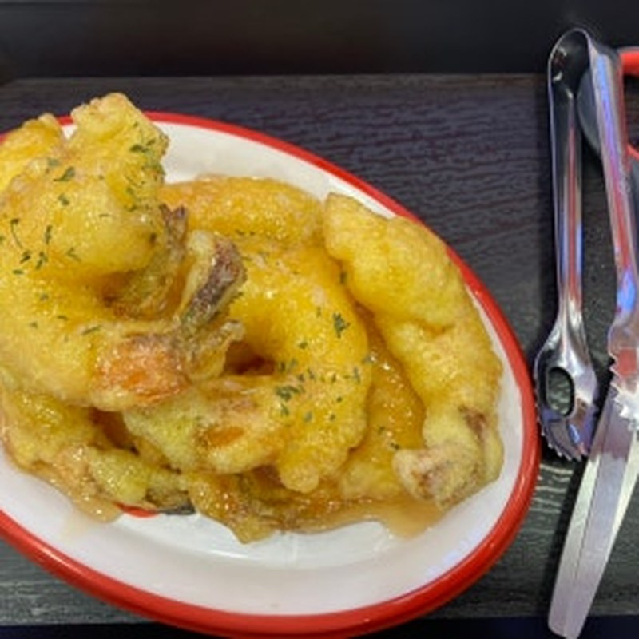

사진: 탕화쿵푸 · 카카오맵/블로그 리뷰 이미지

**취급 식당** 9곳 · **메뉴 항목** 21건 · **가격대** 2,300원 ~ 28,000원 (중앙값 14,450원)

| 식당 | 업종 | 대표 메뉴 · 가격 | 평점(리뷰수) | 캠퍼스 거리 |
|---|---|---|---|---:|
| **차오팡** | 중국요리 | 마파두부밥 10,000원, 고추잡채밥 11,000원, 깐풍기 (소) 22,000원 | 카카오 4.5(56) / 다코 4.4(7) | 792m |
| **보화장** | 중국요리 | 탕수육(소) 17,000원, 깐풍기(소) 25,000원, 팔보채(소) 26,000원 | 카카오 3.6(43) / 다코 2.7(5) | 622m |
| **춘리마라탕** | 중국요리 | 꿔바로우 9,000원 | 카카오 3.8(8) / 다코 5(2) | 246m |
| **중경마라탕** | 중국요리 | 꿔바로우(중) 10,000원, 꿔바로우(대) 15,000원 | 카카오 3.6(14) / 다코 3.8(4) | 163m |
| **한솥도시락인하대후문점** | 한솥도시락 | 미니 찹쌀탕수육 2,300원, 칠리 찹쌀탕수육도련님 5,000원, 더블 칠리 찹쌀탕수육도련님 8,500원 | 카카오 5.0(5) / 다코 3.5(1) | 120m |
| **탕화쿵푸** | 탕화쿵푸마라탕 | 꿔바로우 — | 다코 4.5(1) | 160m |
| **감탄떡볶이** | 감탄떡볶이 | 허브탕수육 5,500원, 칠리탕수육 6,000원 | 카카오 5.0(4) / 다코 5(1) | 111m |
| **화양연화** | 술집 | 꿔바로우 14,900원 | 다코 3.5(1) | 146m |

그 외 1곳: 담벼락

## 샐러드·건강식

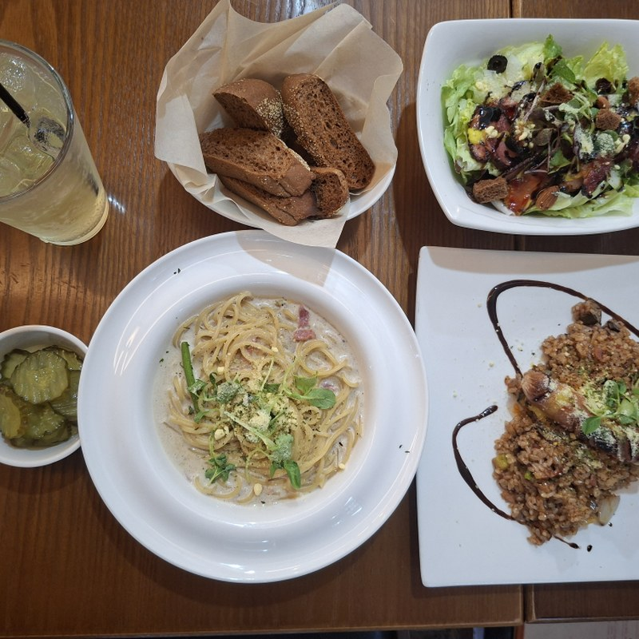

사진: 코피아 · 카카오맵/블로그 리뷰 이미지

**취급 식당** 8곳 · **메뉴 항목** 13건 · **가격대** 6,000원 ~ 16,000원 (중앙값 7,950원)

| 식당 | 업종 | 대표 메뉴 · 가격 | 평점(리뷰수) | 캠퍼스 거리 |
|---|---|---|---|---:|
| **코피아** | 양식 | 신선한 계절 샐러드 6,000원, 오리 가슴살 샐러드 7,500원, 닭가슴살 샐러드 7,500원 | 카카오 4.8(20) / 다코 4.4(5) | 185m |
| **라르고** | 이탈리안 | 구운로메인 잠봉 시저샐러드 15,500원, 스페인식 문어샐러드 16,000원 | 카카오 4.6(5) / 다코 4.7(7) | 857m |
| **압구정수산시장** | 일본식주점 | 토마토양배추샐러드 6,900원 | 카카오 5.0(4) / 다코 5(2) | 132m |
| **오븐마루치킨** | 오븐마루치킨 | 그린샐러드 — | 카카오 5.0(3) / 다코 5(1) | 486m |
| **주접집** | 호프,요리주점 | 카프레제샐러드 — | 카카오 4.6(5) / 다코 4.3(6) | 186m |
| **맥주집** | 호프,요리주점 | 카프레제샐러드 — | 카카오 4.6(5) / 다코 3.5(1) | 211m |
| **로바다야끼 시루** | 일본식주점 | 꿀토마토샐러드 8,000원, 훈제연어샐러드 15,000원 | 카카오 4.1(17) / 다코 4.4(4) | 878m |
| **니센** | 일본식주점 | 시저 샐러드 7,900원 | 카카오 3.8(6) / 다코 5(2) | 175m |

## 디저트·베이커리

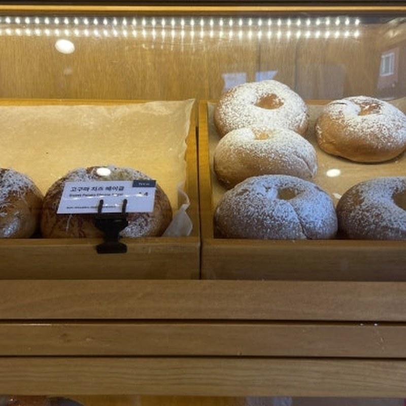

사진: 위플라 · 카카오맵/블로그 리뷰 이미지

**취급 식당** 8곳 · **메뉴 항목** 24건 · **가격대** 3,000원 ~ 9,900원 (중앙값 5,850원)

| 식당 | 업종 | 대표 메뉴 · 가격 | 평점(리뷰수) | 캠퍼스 거리 |
|---|---|---|---|---:|
| **와플뱅** | 제과,베이커리 | 아이스크림씬와플 3,500원, 아이스크림왕플 4,500원 | 카카오 4.9(23) / 다코 4.5(2) | 153m |
| **위플라** | 카페 | 플레인 베이글 3,000원, 호떡 베이글 3,500원, 누텔라 베이글 3,800원 | 카카오 4.2(5) / 다코 3.4(3) | 194m |
| **huki** | 카페 | 바스크 치즈 케이크 6,000원, 스트로베리 초코 갸또 케이크 6,500원, 딸기 쑥 인절미 갸또 케이크 7,000원 | 카카오 4.9(9) / 다코 5(2) | 450m |
| **더즈오프커피** | 카페 | 오레오아이스케이크 5,700원 | 카카오 4.6(14) / 다코 4(2) | 550m |
| **요거트월드** | 요거트월드 | 1인 요거트아이스크림 4,500원 | 카카오 3.6(10) / 다코 3.6(3) | 325m |
| **화양연화** | 술집 | 바닐라 아이스크림 8,900원, 아이스크림와플 9,900원, 아이스크림 씨앗호떡 9,900원 | 다코 3.5(1) | 146m |
| **주접집** | 호프,요리주점 | 아이스크림 — | 카카오 4.6(5) / 다코 4.3(6) | 186m |
| **맥주집** | 호프,요리주점 | 아이스크림 — | 카카오 4.6(5) / 다코 3.5(1) | 211m |

## 스테이크·양식

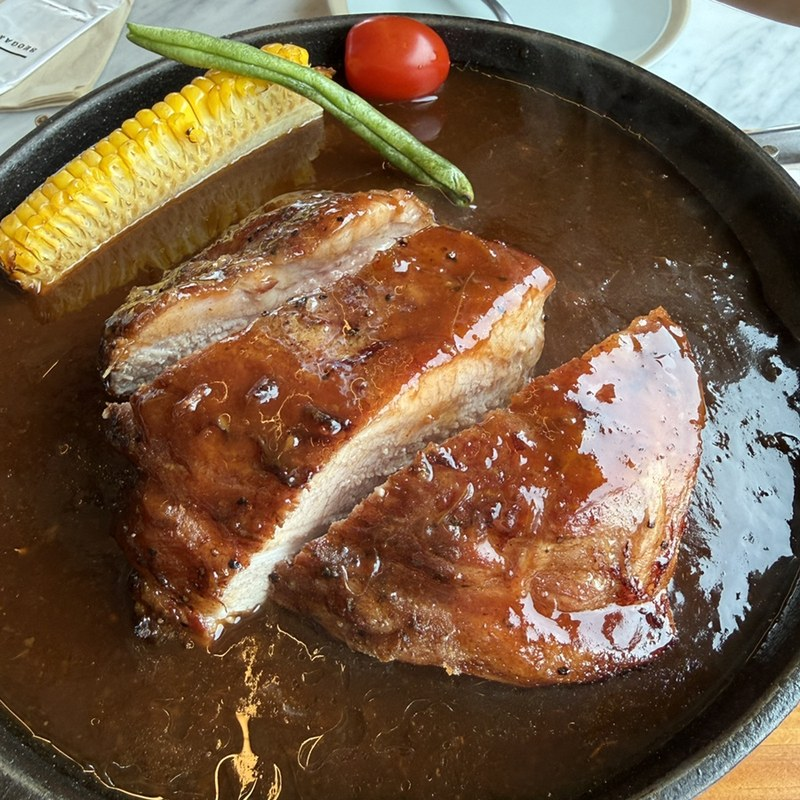

사진: 서가앤쿡 · 카카오맵/블로그 리뷰 이미지

**취급 식당** 8곳 · **메뉴 항목** 16건 · **가격대** 7,500원 ~ 64,800원 (중앙값 40,400원)

| 식당 | 업종 | 대표 메뉴 · 가격 | 평점(리뷰수) | 캠퍼스 거리 |
|---|---|---|---|---:|
| **서가앤쿡** | 서가앤쿡 | 목살 스테이크 한상 39,900원, 함박 스테이크 한상 40,900원, 돈 LA 갈비 스테이크 한상 40,900원 | 카카오 3.3(12) / 다코 4.1(7) | 704m |
| **한솥도시락인하대후문점** | 한솥도시락 | 한우 함박스테이크& 청양 토네이도 소세지 9,000원, 한우 함박스테이크& 토네이도 소세지 9,000원, 스페셜 한우함박스테이크 도시락 14,000원 | 카카오 5.0(5) / 다코 3.5(1) | 120m |
| **라르고** | 이탈리안 | 한우채끝 스모킹 그릴스테이크 45,000원, 육즙 넘치는 부드러운 안심스테이크 49,000원 | 카카오 4.6(5) / 다코 4.7(7) | 857m |
| **국제식당** | 일본식주점 | 함박 철판 13,500원 | 카카오 4.3(18) / 다코 4.6(3) | 170m |
| **국밥참맛있는집** | 국밥참맛있는집 | 함박떡갈비 — | 카카오 4.2(12) / 다코 5(1) | 905m |
| **니센** | 일본식주점 | 치킨 스테이크 14,900원 | 카카오 3.8(6) / 다코 5(2) | 175m |
| **소풍** | 분식 | 오므라이스 7,500원 | 카카오 3.0(5) / 다코 2(2) | 676m |
| **긴자료코** | 긴자료코 | 함박스테이크 — | 카카오 2.5(10) / 다코 2.7(2) | 776m |

## 피자

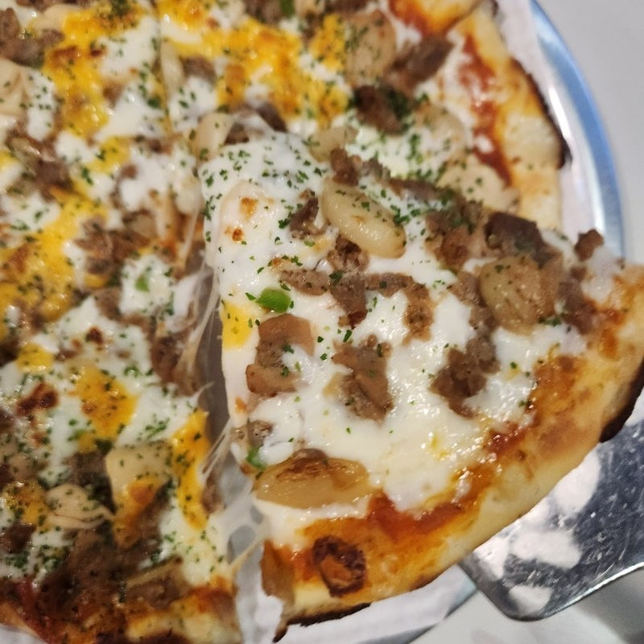

사진: 치즈웨이브 · 카카오맵/블로그 리뷰 이미지

**취급 식당** 8곳 · **메뉴 항목** 32건 · **가격대** 3,800원 ~ 22,000원 (중앙값 17,950원)

| 식당 | 업종 | 대표 메뉴 · 가격 | 평점(리뷰수) | 캠퍼스 거리 |
|---|---|---|---|---:|
| **라르고** | 이탈리안 | 마르게리따 피자 19,000원, 페퍼로니피자 19,000원, 칠리 쉬림프 피자 20,000원 | 카카오 4.6(5) / 다코 4.7(7) | 857m |
| **레오펍** | 피자 | 치즈피자 (조각) 3,800원 | 카카오 4.8(29) / 다코 3.9(3) | 137m |
| **치즈웨이브** | 피자 | 치즈피자 17,900원 | 카카오 4.0(13) / 다코 3.8(4) | 703m |
| **주접집** | 호프,요리주점 | 마르게리따피자 —, 피자 —, 풍기피자 — | 카카오 4.6(5) / 다코 4.3(6) | 186m |
| **맥주집** | 호프,요리주점 | 마르게리따피자 —, 피자 —, 풍기피자 — | 카카오 4.6(5) / 다코 3.5(1) | 211m |
| **아미고** | 호프,요리주점 | 존슨빌쏘세지피자 (S) 9,900원, 불고기피자 (L) 17,000원 | 카카오 3.7(7) / 다코 3.4(3) | 210m |
| **까사 올리브** | 양식 | 피자런치세트 (2인가) 18,000원 | 카카오 3.9(11) / 다코 3.3(2) | 274m |
| **서가앤쿡** | 서가앤쿡 | 고르곤졸라 피자 10,900원, 페퍼로니 피자 11,900원 | 카카오 3.3(12) / 다코 4.1(7) | 704m |

## 마라탕·마라샹궈

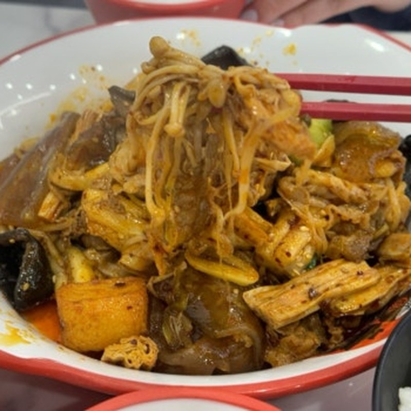

사진: 탕화쿵푸 · 카카오맵/블로그 리뷰 이미지

**취급 식당** 7곳 · **메뉴 항목** 13건 · **가격대** 1,800원 ~ 21,000원 (중앙값 7,000원)

| 식당 | 업종 | 대표 메뉴 · 가격 | 평점(리뷰수) | 캠퍼스 거리 |
|---|---|---|---|---:|
| **탕화쿵푸** | 탕화쿵푸마라탕 | 마라비빔 —, 토마토마라탕 —, 마라샹궈 — | 다코 4.5(1) | 160m |
| **춘리마라탕** | 중국요리 | 마라탕 (100g) 1,800원, 마라샹궈 (100g) 3,000원 | 카카오 3.8(8) / 다코 5(2) | 246m |
| **중경마라탕** | 중국요리 | 마라샹궈(100g) 3,000원, 마라탕(100g) 7,000원 | 카카오 3.6(14) / 다코 3.8(4) | 163m |
| **일미닭갈비파전** | 닭요리 | 마라닭삼(2인) 21,000원, 마라쭈닭(2인) 21,000원 | 카카오 4.8(18) / 다코 4(3) | 139m |
| **이모떡즉석떡볶이** | 떡볶이 | 마라 즉떡 7,000원 | 카카오 4.3(28) / 다코 4.2(4) | 140m |
| **금산양꼬치** | 양꼬치 | 마라탕 9,000원 | 카카오 3.4(39) / 다코 4.5(4) | 260m |
| **화양연화** | 술집 | 마라샹궈 14,900원 | 다코 3.5(1) | 146m |

## 양꼬치

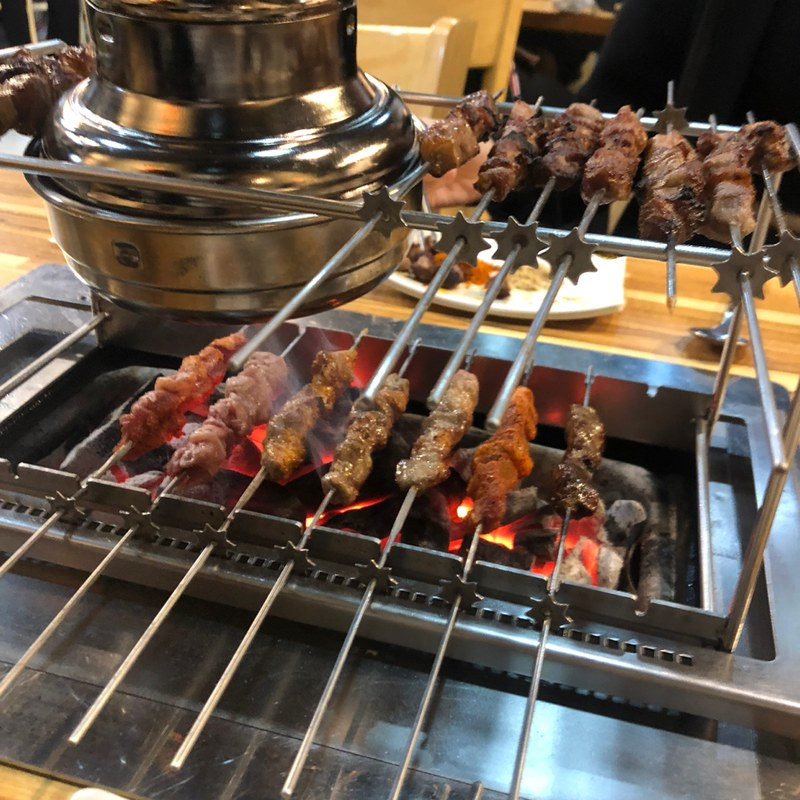

사진: 금산양꼬치 · 카카오맵/블로그 리뷰 이미지

**취급 식당** 6곳 · **메뉴 항목** 26건 · **가격대** 2,800원 ~ 33,000원 (중앙값 4,650원)

| 식당 | 업종 | 대표 메뉴 · 가격 | 평점(리뷰수) | 캠퍼스 거리 |
|---|---|---|---|---:|
| **미연팔복반점** | 중식 | 양꼬치(10개) 12,000원, 양갈비살(10개) 13,000원, 고급양갈비 33,000원 | 카카오 4.2(29) / 다코 4.2(5) | 355m |
| **화경양꼬치** | 양꼬치 | 양꼬치(10꼬치) 14,000원 | 카카오 4.0(4) / 다코 5(1) | 156m |
| **금산양꼬치** | 양꼬치 | 양꼬치 14,000원, 숙성양꼬치 14,000원 | 카카오 3.4(39) / 다코 4.5(4) | 260m |
| **로바다야끼 시루** | 일본식주점 | 은행 꼬치구이(2EA) 2,800원, 가지 꼬치구이(2EA) 3,500원, 염통 꼬치구이(2EA) 3,500원 | 카카오 4.1(17) / 다코 4.4(4) | 878m |
| **이선생** | 중국요리 | 숙성양갈비살(100g) 14,000원, 숙성양갈비(120g) 15,000원 | 카카오 4.3(3) / 다코 5(2) | 776m |
| **동네술집** | 호프,요리주점 | 염통꼬치구이(10p) 12,000원, 순살닭꼬치구이(4p) 12,500원 | 카카오 4.5(6) / 다코 4(1) | 574m |

## 술·주류

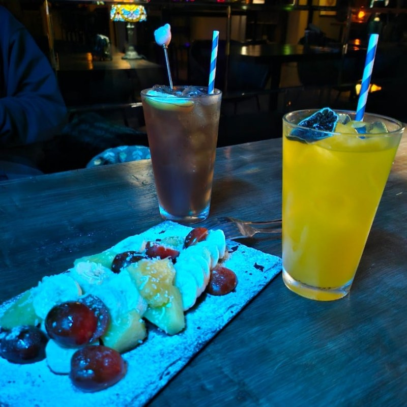

사진: 오드룸 · 카카오맵/블로그 리뷰 이미지

**취급 식당** 6곳 · **메뉴 항목** 18건 · **가격대** 3,000원 ~ 9,000원 (중앙값 7,000원)

| 식당 | 업종 | 대표 메뉴 · 가격 | 평점(리뷰수) | 캠퍼스 거리 |
|---|---|---|---|---:|
| **순목** | 호프,요리주점 | 조니워커 레드 하이볼 7,000원, 짐빔 하이볼 7,000원, 산토리 하이볼 7,000원 | 카카오 5.0(2) / 다코 5(1) | 166m |
| **치즈웨이브** | 피자 | 맥주 —, 하이볼 — | 카카오 4.0(13) / 다코 3.8(4) | 703m |
| **더문** | 칵테일바 | 커스텀칵테일 — | 카카오 3.9(17) / 다코 4.5(2) | 134m |
| **인하칼국수** | 칼국수 | 막걸리 3,000원, 소주 4,500원, 맥주 5,000원 | 카카오 4.2(34) / 다코 4.3(8) | 168m |
| **오드룸** | 칵테일바 | 짐빔 하이볼 8,500원, 산토리 하이볼 8,500원, 피치/멜론 하이볼 8,500원 | 카카오 4.1(7) / 다코 3.5(1) | 243m |
| **빙그레정육식당** | 육류,고기 | 소주 맥주 5,000원 | 카카오 4.6(12) / 다코 4.6(3) | 172m |

## 곱창·막창

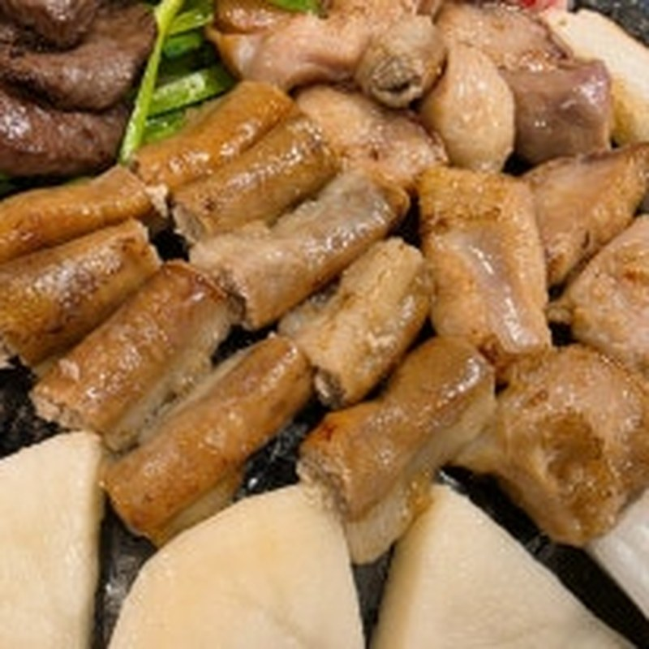

사진: 동춘돌곱창 · 카카오맵/블로그 리뷰 이미지

**취급 식당** 5곳 · **메뉴 항목** 9건 · **가격대** 16,000원 ~ 20,000원 (중앙값 18,000원)

| 식당 | 업종 | 대표 메뉴 · 가격 | 평점(리뷰수) | 캠퍼스 거리 |
|---|---|---|---|---:|
| **동춘돌곱창** | 곱창,막창 | 한우대창 (200g) 18,000원, 막창구이 (200g) 18,000원, 한우곱창 (200g) 20,000원 | 카카오 3.2(9) / 다코 3.4(2) | 776m |
| **남도뽀글이** | 곱창,막창 | 소곱창(1인분) 16,000원, 소막창(1인분) 18,000원, 대창(1인분) 19,000원 | 카카오 2.7(18) / 다코 4.7(7) | 320m |
| **경동삼겹살** | 삼겹살 | 곱창 막창 대창(170g) 16,000원 | 카카오 4.4(21) / 다코 4.8(4) | 126m |
| **하남돼지집** | 하남돼지집 | 막창구이 — | 카카오 3.8(6) / 다코 4(2) | 891m |
| **더진국 수육국밥** | 더진국 | 철판소곱창볶음 — | 카카오 2.3(22) / 다코 3.2(3) | 137m |

## 찜닭

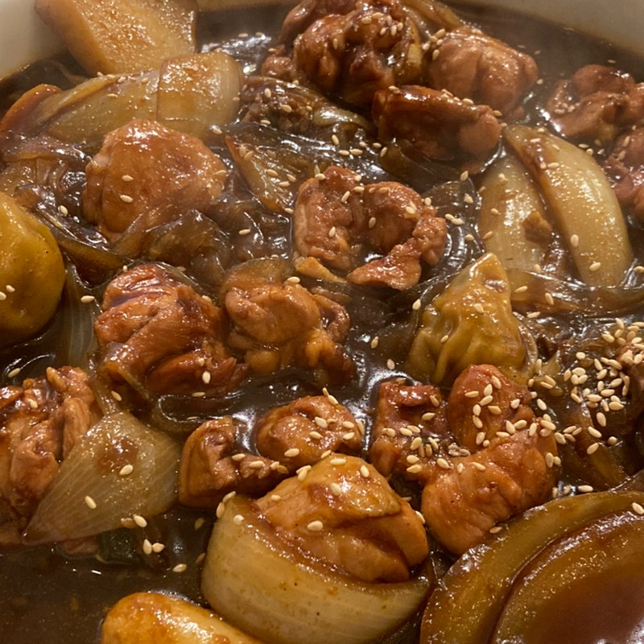

사진: 치즈를사랑한찜닭 · 카카오맵/블로그 리뷰 이미지

**취급 식당** 4곳 · **메뉴 항목** 18건 · **가격대** 12,000원 ~ 44,000원 (중앙값 25,000원)

| 식당 | 업종 | 대표 메뉴 · 가격 | 평점(리뷰수) | 캠퍼스 거리 |
|---|---|---|---|---:|
| **치즈를사랑한찜닭** | 닭요리 | 까망,빨강찜닭(소) 22,000원, 치사한찜닭(소) 28,000원, 까망,빨강찜닭(중) 30,000원 | 카카오 4.5(10) / 다코 3.9(6) | 138m |
| **고수찜닭** | 닭요리 | 매콤달콤 고수찜닭 (소) 22,000원, 화끈한 쇼킹찜닭 (소) 22,000원, 순한맛 순수찜닭 (소) 22,000원 | 카카오 3.9(36) / 다코 4.3(7) | 146m |
| **내가찜한닭** | 닭요리 | 순살안동찜닭 (소/중/대) —, 매콤순살고추장찜닭 (소/중/대) —, 반한 찜닭(소/중/대) — | 카카오 2.8(6) / 다코 4.8(5) | 109m |
| **명가찜닭** | 닭요리 | 찜닭 小 12,000원, 찜닭 中 20,000원, 찜닭 大 30,000원 | 카카오 5.0(1) | 380m |

## 전·부침개

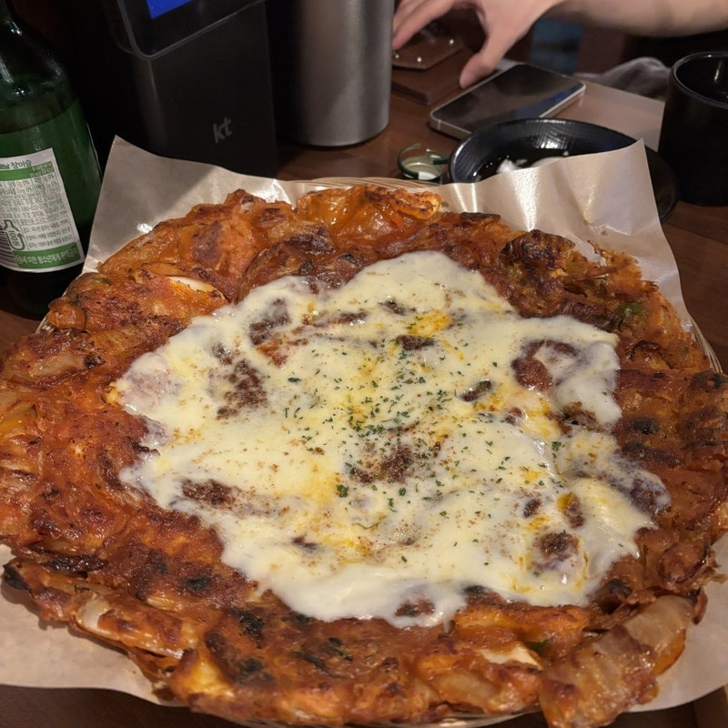

사진: 넋넋 · 카카오맵/블로그 리뷰 이미지

**취급 식당** 3곳 · **메뉴 항목** 8건 · **가격대** 7,900원 ~ 14,900원 (중앙값 11,400원)

| 식당 | 업종 | 대표 메뉴 · 가격 | 평점(리뷰수) | 캠퍼스 거리 |
|---|---|---|---|---:|
| **넋넋** | 호프,요리주점 | 해물김치전 13,900원, 감자전 13,900원, 해물파전 14,900원 | 카카오 4.3(18) / 다코 4.9(4) | 819m |
| **압구정수산시장** | 일본식주점 | 김치전 7,900원, 명란치즈감자전 8,900원, 새우부추전 8,900원 | 카카오 5.0(4) / 다코 5(2) | 132m |
| **래빗포차** | 음식점 | 김치전 —, 부추전 — | 카카오 5.0(1) | 917m |

## 쌀국수·베트남

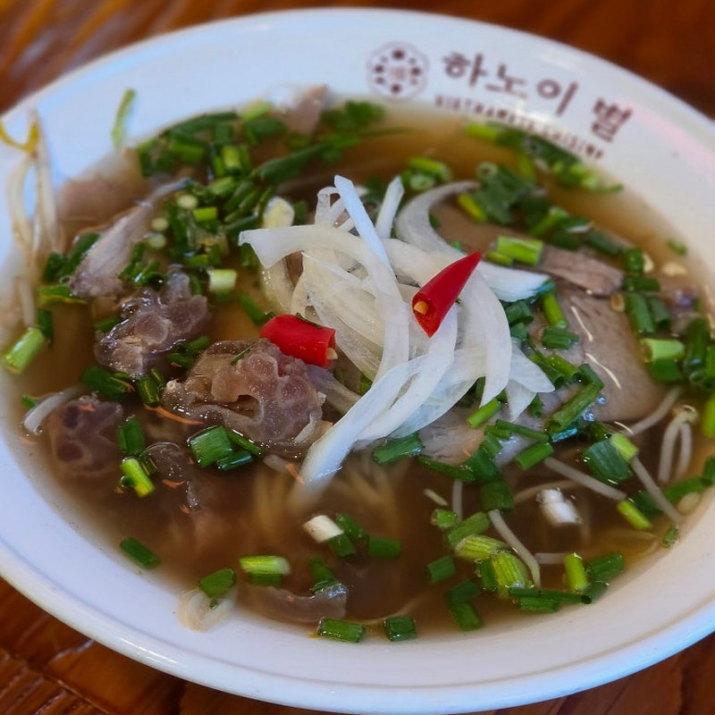

사진: 하노이 별 · 카카오맵/블로그 리뷰 이미지

**취급 식당** 3곳 · **메뉴 항목** 25건 · **가격대** 3,000원 ~ 17,000원 (중앙값 11,000원)

| 식당 | 업종 | 대표 메뉴 · 가격 | 평점(리뷰수) | 캠퍼스 거리 |
|---|---|---|---|---:|
| **하노이 별** | 베트남음식 | 수제 고기 짜조 3,000원, 양지와 차돌박이 쌀국수(소) 8,900원, 양지와 차돌박이 쌀국수(보통) / 하노이별의 시그니쳐 메뉴 입니다. 9,900원 | 카카오 4.8(22) / 다코 4.1(6) | 187m |
| **운반미** | 베트남음식 | 월남쌈(3개) 5,000원, 한우사태쌀국수 9,900원, 분짜 10,500원 | 카카오 4.9(13) / 다코 5(1) | 153m |
| **면식당** | 면식당 | 샤브쌀국수 8,900원, 매운 샤브쌀국수 9,500원 | 카카오 3.1(9) / 다코 4.6(3) | 99m |

## 닭갈비

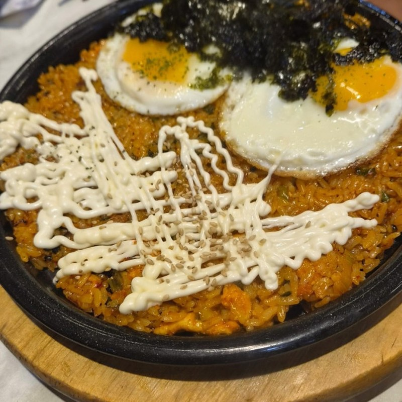

사진: 팔각도 · 카카오맵/블로그 리뷰 이미지

**취급 식당** 3곳 · **메뉴 항목** 12건 · **가격대** 17,000원 ~ 42,000원 (중앙값 25,000원)

| 식당 | 업종 | 대표 메뉴 · 가격 | 평점(리뷰수) | 캠퍼스 거리 |
|---|---|---|---|---:|
| **일미닭갈비파전** | 닭요리 | 닭갈비(2인) 17,000원, 마라닭갈비(2인) 18,000원, 치즈닭갈비(2인) 20,000원 | 카카오 4.8(18) / 다코 4(3) | 139m |
| **동아리닭갈비** | 닭요리 | 닭갈비(2인) 18,000원, 삼겹+닭갈비(2인) 20,000원, 닭갈비(3인) 25,000원 | 카카오 4.2(21) / 다코 4.5(6) | 185m |
| **팔각도** | 팔각도 | 숯불 닭갈비 — | 카카오 4.0(10) / 다코 4.2(4) | 770m |

## 갈비찜·찜요리

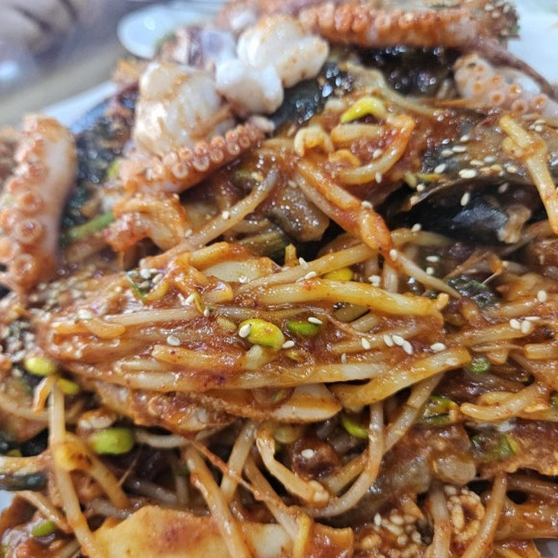

사진: 동원물텀벙 · 카카오맵/블로그 리뷰 이미지

**취급 식당** 2곳 · **메뉴 항목** 14건 · **가격대** 33,000원 ~ 70,000원 (중앙값 48,500원)

| 식당 | 업종 | 대표 메뉴 · 가격 | 평점(리뷰수) | 캠퍼스 거리 |
|---|---|---|---|---:|
| **동원물텀벙** | 아구 | 아구찜 (소) 35,000원, 들깨아구찜 (소) 35,000원, 해물찜 (소) 45,000원 | 카카오 4.6(7) / 다코 4.7(3) | 850m |
| **매운애 갈비찜** | 갈비 | 매운애 갈비찜 작은 애 (2~3인) 33,000원, 매운애 갈비찜 중간 애 (3~4인) 41,000원, 매운애 갈비찜 큰 애 (4~5인) 49,000원 | 카카오 4.4(9) / 다코 4.1(3) | 146m |

## 보쌈·족발

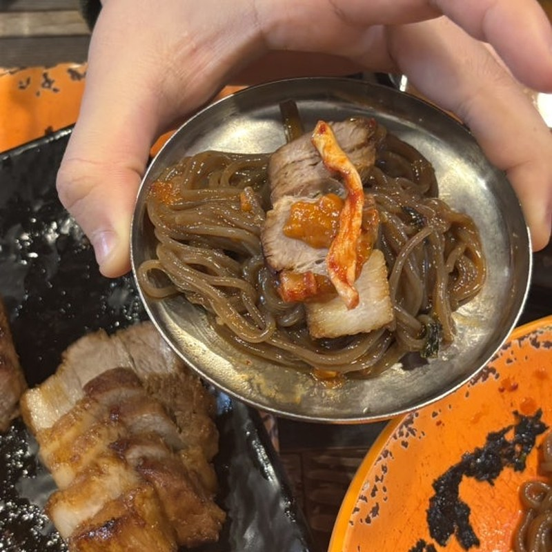

사진: 궁중보쌈 · 카카오맵/블로그 리뷰 이미지

**취급 식당** 2곳 · **메뉴 항목** 6건 · **가격대** 9,500원 ~ 47,000원 (중앙값 10,000원)

| 식당 | 업종 | 대표 메뉴 · 가격 | 평점(리뷰수) | 캠퍼스 거리 |
|---|---|---|---|---:|
| **궁중보쌈** | 족발,보쌈 | 지짐보쌈정식 9,500원, 매운지짐보쌈정식 10,000원, 마늘지짐보쌈정식 10,000원 | 카카오 3.3(27) / 다코 3.7(8) | 138m |
| **더진국 수육국밥** | 더진국 | 착한보쌈 — | 카카오 2.3(22) / 다코 3.2(3) | 137m |

---

## 참고 · 데이터 파일

- `data/menus-by-category.json` — 메뉴 카테고리별 식당·가격·평점 (본 문서의 원본 데이터)
- `data/restaurants.json` — 식당 177곳의 전체 메뉴·평점·좌표·주소
- `data/photo-sources.json` — 대표사진 37장의 출처 URL
- `images/` — 메뉴별 대표사진 37장, 전부 800×800 JPEG

사진은 카카오맵 리뷰·블로그 리뷰·다이닝코드에 게시된 이용자 촬영 이미지입니다. 조사·참고 목적의 로컬 사본이며 저작권은 각 게시자에게 있으므로 재배포·상업적 이용에는 별도 확인이 필요합니다.
